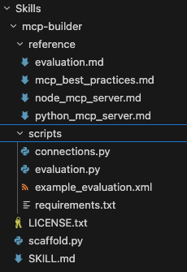
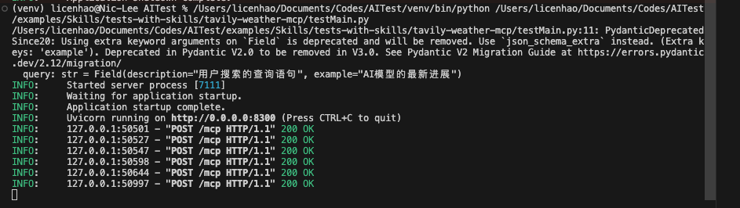
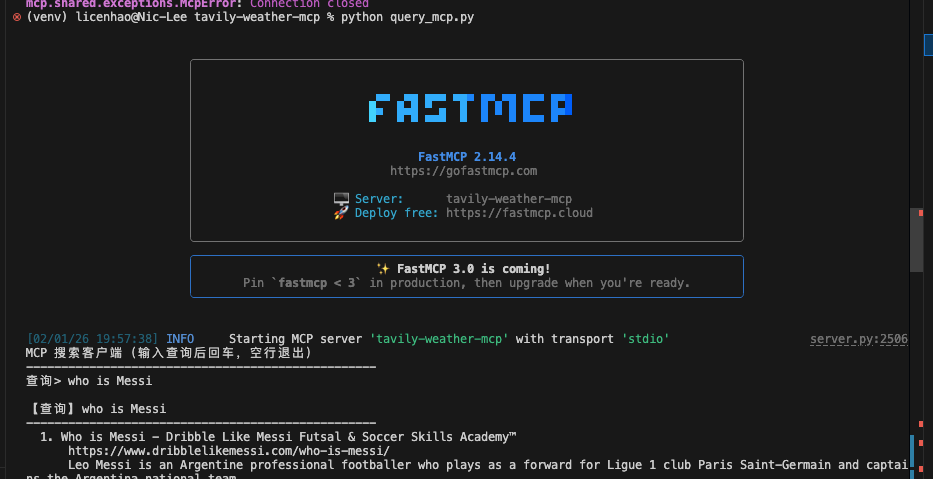
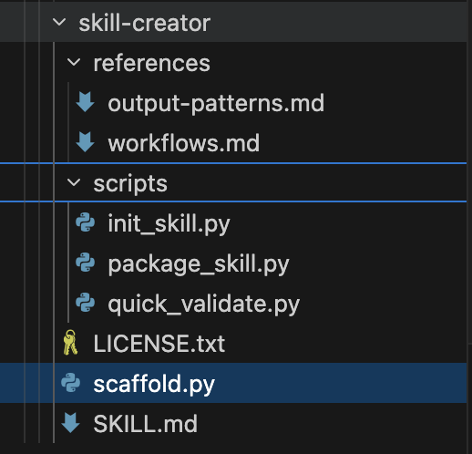

## 文档摘要(Create by skill)
本文档分为三部分：背景、MCP Builder实践和Skill Creator实践。
背景部分指出Skills是渐进式披露的多能力调用框架，区别于MCP tools的全量上下文加载方式，可动态调用脚本工具。
MCP Builder实践部分描述了基于Ollama模型的技能执行框架，通过解析SKILL.md文件实现用户请求与技能指南的匹配，生成具体执行步骤。文档引用了Anthropic Skills和国内技能平台作为参考。Skill Creator部分未展开具体内容，但结构上与MCP Builder并列。本文档核心在于说明Skills框架的渐进式能力调用机制及其实现方案。
文档介绍了“markdown-summarizer”Skill，用于使用本地Ollama模型生成Markdown文档的中文摘要并插入至开头。包含功能说明、参数配置、使用方式及环境准备要求，提供命令行示例。结构包含Skill描述、脚本文件和参考文档，支持指定模型和文件路径进行文档处理。内容涵盖模型调用流程、参数定义及执行示例，说明需安装Ollama服务和Python依赖，通过脚本实现文档自动摘要功能。

- [Background](#Background)
- [Practice-MCP-Builder](#Practice-MCP-Builder)
	- [Implementation](#Implementation)
	- [以下是输出](#%E4%BB%A5%E4%B8%8B%E6%98%AF%E8%BE%93%E5%87%BA)
- [Practice-Skill-Creator](#Practice-Skill-Creator)
	- [Implementation](#Implementation)
	- [以下是输出](#%E4%BB%A5%E4%B8%8B%E6%98%AF%E8%BE%93%E5%87%BA)

## Background
20260121, 阅读了卡兹克三篇关于Skills的讲解
[一文带你看懂，火爆全网的Skills到底是个啥。](https://mp.weixin.qq.com/s/nRVVqPaGxWdNqNrUcurSXg)

其实更加明确了，Skills并不是只某种multiple agent的搭建方式。
也不是简单的动态加载prompt。

它和MCP tools的区别，可以 有 progressive disclosure的概念。
也就是渐进式披露，需要哪些能力，渐进式的加载，而不是将MCP tool的所有规范和上下文，全部一股脑的放在prompt里当作context每次都传给llm，耗时耗力。

而Skill自身，也不局限于prompt的渐进式披露，也可以包含可执行的脚本/工具的动态披露。
让llm知道有哪些技能包，然后有选择的动态调用。

Reference：
[anthropics skills](https://github.com/anthropics/skills)
[国内的技能应用平台](https://www.coze.cn/skills)

## Practice-MCP-Builder
 ```
 实验环境：
 llm：qwen3:14b
 target：通过 anthropic 提供的官方skills中的MCP builder, 构建一个web search的MCP Server
 ```

https://github.com/anthropics/skills/tree/main/skills/mcp-builder
### Implementation


其中只有一个脚手架scaffold是自己填写的，主要就是配置本地的ollama模型-qwen3
去加载这个Skill.md，相当于告诉model你应该怎么使用这个mcp-builder
```python
"""
MCP Builder Skill scaffold — 使用本地 Ollama 运行 MCP Builder 技能。

解析 SKILL.md（YAML frontmatter + Markdown 流程说明），将用户请求与技能描述
一并交给 Ollama 模型，由模型按技能指南给出建议或步骤。
"""

import argparse
import os
import re
from pathlib import Path

try:
    import ollama
except ImportError:
    raise ImportError("请先安装 ollama Python 客户端: pip install ollama")

# 默认使用的 Ollama 模型，可通过环境变量 OLLAMA_MODEL 或 --model 覆盖
DEFAULT_MODEL = os.environ.get("OLLAMA_MODEL", "llama3.1:8b")


def _skill_dir() -> Path:
    """返回 scaffold 所在目录（即 mcp-builder skill 根目录）。"""
    return Path(__file__).resolve().parent


def parse_skill_md(skill_md_path: str | Path | None = None) -> dict:
    """
    解析 SKILL.md：提取 YAML frontmatter（name, description, license）及正文内容。

    Args:
        skill_md_path: SKILL.md 路径，默认使用与 scaffold 同目录下的 SKILL.md。

    Returns:
        包含 name, description, license, content 的字典。
    """
    path = Path(skill_md_path) if skill_md_path else _skill_dir() / "SKILL.md"
    if not path.is_file():
        raise FileNotFoundError(f"未找到技能文件: {path}")

    text = path.read_text(encoding="utf-8")

    # 解析 YAML frontmatter (--- ... ---)
    front_match = re.match(r"^---\s*\n(.*?)\n---\s*\n", text, re.DOTALL)
    config = {}
    if front_match:
        front = front_match.group(1)
        for line in front.strip().split("\n"):
            m = re.match(r"^(\w+):\s*(.*)$", line.strip())
            if m:
                config[m.group(1).strip()] = m.group(2).strip()
        content = text[front_match.end() :].strip()
    else:
        content = text.strip()

    config["content"] = content
    return config


def run_skill_with_ollama(
    skill_config: dict,
    user_input: str,
    model: str | None = None,
) -> str:
    """
    使用本地 Ollama 模型按 MCP Builder 技能指南响应用户请求。

    Args:
        skill_config: parse_skill_md() 返回的配置（含 name, description, content）。
        user_input: 用户的问题或需求（例如：帮我生成一个 MCP Server，用于调用计算器工具）。
        model: Ollama 模型名，默认使用 DEFAULT_MODEL（或环境变量 OLLAMA_MODEL）。

    Returns:
        模型生成的回复文本。
    """
    model = model or DEFAULT_MODEL
    name = skill_config.get("name", "mcp-builder")
    description = skill_config.get("description", "")
    content = skill_config.get("content", "")

    # 将技能流程与用户输入一起交给模型
    prompt = f"""你正在使用「{name}」技能。该技能的说明如下：

## 技能描述
{description}

## 技能流程与参考（请按此指南回答）
{content[:12000]}

---

用户请求：
{user_input}

请严格按照上述 MCP Builder 技能指南，针对用户请求给出具体、可执行的建议或步骤（例如如何设计工具、项目结构、调用方式等）。若需生成代码，请直接写出可用代码片段。"""

    response = ollama.chat(
        model=model,
        messages=[{"role": "user", "content": prompt}],
    )
    return response.get("message", {}).get("content", "")


def main() -> None:
    parser = argparse.ArgumentParser(
        description="使用本地 Ollama 运行 MCP Builder 技能（解析 SKILL.md 并调用模型）"
    )
    parser.add_argument(
        "--model", "-m",
        default=DEFAULT_MODEL,
        help=f"Ollama 模型名（默认: {DEFAULT_MODEL}，或环境变量 OLLAMA_MODEL）",
    )
    parser.add_argument(
        "--input", "-i",
        default="帮我生成一个 MCP Server，用于调用计算器工具",
        help="用户请求内容",
    )
    parser.add_argument(
        "--skill-file",
        default=None,
        help="SKILL.md 路径（默认使用与 scaffold 同目录的 SKILL.md）",
    )
    parser.add_argument(
        "--no-run",
        action="store_true",
        help="仅解析并打印技能配置，不调用 Ollama",
    )
    args = parser.parse_args()

    skill_path = args.skill_file or (_skill_dir() / "SKILL.md")
    skill_config = parse_skill_md(skill_path)

    print("解析到的技能配置：")
    for k in ("name", "description", "license"):
        if k in skill_config:
            print(f"  {k}: {skill_config[k]}")
    print()

    if args.no_run:
        print("（已使用 --no-run，跳过 Ollama 调用）")
        return

    print(f"使用模型: {args.model}")
    print(f"用户请求: {args.input}")
    print("-" * 40)
    result = run_skill_with_ollama(skill_config, args.input, model=args.model)
    print("技能执行结果：")
    print(result)


if __name__ == "__main__":
    main()

```

然后你就会得到
```
python scaffold.py --model qwen3:latest --input "帮我生成一个使用tavily-search的提供web search的MCP SERVER，只提供核心能力，不包含跨域和认证等功能，保证引入包和类的准确性，python实现"
```
=======================================================================
### 以下是输出
=======================================================================

解析到的技能配置：
  name: mcp-builder
  description: Guide for creating high-quality MCP (Model Context Protocol) servers that enable LLMs to interact with external services through well-designed tools. Use when building MCP servers to integrate external APIs or services, whether in Python (FastMCP) or Node/TypeScript (MCP SDK).
  license: Complete terms in LICENSE.txt

使用模型: qwen3:latest
用户请求: 帮我生成一个使用tavily-search的提供web search的MCP SERVER，只提供核心能力，不包含跨域和认证等功能，保证引入包和类的准确性，python实现
----------------------------------------
技能执行结果：
以下是使用 Tavily Search 实现的 Python MCP 服务器核心代码，严格遵循 MCP Builder 技术指南：

```python
# main.py
import os
import requests
from fastapi import FastAPI
from pydantic import BaseModel, Field
from mcp import McpError
from mcp.types import ErrorData

# 1. 定义工具输入输出 schema
class SearchQuery(BaseModel):
    query: str = Field(description="用户搜索的查询语句", example="AI模型的最新进展")

class SearchResult(BaseModel):
    results: list = Field(description="搜索结果列表，包含标题、链接和摘要")
    total_results: int = Field(description="总结果数量")

# 2. 实现搜索工具
def tavily_search(query: SearchQuery) -> SearchResult:
    """
    使用 Tavily Search API 进行网络搜索
    
    参数:
        query: 用户搜索的查询语句
        
    返回:
        搜索结果列表，包含标题、链接和摘要
    """
    api_key = os.getenv("TAVILY_API_KEY")
    if not api_key:
        raise McpError(ErrorData(code=-32602, message="TAVILY_API_KEY 环境变量未设置", data=None))
    
    BASE_URL = "https://api.tavily.com/search"
    try:
        q = query.query if isinstance(query, SearchQuery) else query
        response = requests.post(
                BASE_URL,
                json={"query": q},
                headers={"Authorization": f"Bearer {api_key}"},
        )
        response.raise_for_status()
        data = response.json()
        return SearchResult(results=data.get("results", []), total_results=len(data.get("results", [])))
    except requests.RequestException as e:
        raise McpError(ErrorData(code=-32603, message=f"网络请求失败: {str(e)}", data=None))

# 3. 初始化 MCP 服务器
app = FastAPI()

# 4. 注册工具到 MCP 服务器
@app.get("/tools")
def list_tools():
    """列出所有可用工具"""
    return {
        "tools": [
            {
                "name": "tavily_search",
                "description": "使用 Tavily Search API 进行网络搜索",
                "parameters": {"type": "object", "properties": {"query": {"type": "string"}}},
                "returns": {"type": "object", "properties": {"results": [{"type": "object", "properties": {"title": {"type": "string"}, "url": {"type": "string"}, "content": {"type": "string"}}}], "total_results": {"type": "integer"}}}
            }
        ]
    }

# 5. 处理 MCP 请求
@app.post("/mcp")
def handle_mcp_request(data: dict):
    """处理 MCP 请求并返回结果"""
    try:
        # 调用工具
        result = tavily_search(SearchQuery(**data))
        return {
            "content": f"找到 {result.total_results} 个相关结果:\n" + 
                      "\n".join([f"{i+1}. [{r['title']}]({r['url']}) - {r.get('content', '')[:100]}..." for i, r in enumerate(result.results[:5])]) 
        }
    except McpError as e:
        return {"error": str(e)}
    except Exception as e:
        return {"error": f"未知错误: {str(e)}"}

# 6. 启动服务器
if __name__ == "__main__":
    import uvicorn
    uvicorn.run(app, host="0.0.0.0", port=8300)
```

**使用说明：**

1. 安装依赖：
```bash
pip install fastapi uvicorn pydantic requests
```

2. 设置环境变量：
```bash
export TAVILY_API_KEY="your_tavily_api_key"
```

3. 运行服务器：
```bash
python main.py
```

4. 使用 MCP 客户端调用：
```bash
"""
使用 MCP 服务器进行 Tavily 搜索的客户端脚本。
用法:
  python query_mcp.py "搜索关键词"
  python query_mcp.py   # 无参数时进入交互模式
"""
import asyncio
import sys
from pathlib import Path

from fastmcp import Client
from fastmcp.client import PythonStdioTransport

_ROOT = Path(__file__).resolve().parent


def format_result(result) -> str:
    """将 call_tool 返回结果格式化为可读文本"""
    lines = []
    if hasattr(result, "structured_content") and result.structured_content:
        data = result.structured_content
        results = data.get("results", [])
        if not results:
            return "未找到结果。"
        for i, r in enumerate(results, 1):
            if isinstance(r, dict):
                if "error" in r:
                    lines.append(f"  {i}. [错误] {r['error']}")
                else:
                    title = r.get("title", "(无标题)")
                    url = r.get("url", "")
                    content = (r.get("content") or "")[:150]
                    lines.append(f"  {i}. {title}")
                    lines.append(f"      {url}")
                    if content:
                        lines.append(f"      {content}...")
            else:
                lines.append(f"  {i}. {r}")
    elif hasattr(result, "content") and result.content:
        for block in result.content:
            if hasattr(block, "text"):
                lines.append(block.text)
    return "\n".join(lines) if lines else str(result)


async def run_query(client: Client, query: str) -> None:
    result = await client.call_tool("tavily_search", {"query": query})
    print(f"\n【查询】{query}")
    print("-" * 50)
    print(format_result(result))
    print()


async def main():
    transport = PythonStdioTransport(
        script_path=_ROOT / "main.py",
        cwd=str(_ROOT),
        python_cmd=sys.executable,
    )
    async with Client(transport=transport) as client:
        if len(sys.argv) > 1:
            query = " ".join(sys.argv[1:])
            await run_query(client, query)
        else:
            print("MCP 搜索客户端（输入查询后回车，空行退出）")
            print("-" * 50)
            while True:
                try:
                    query = input("查询> ").strip()
                except (EOFError, KeyboardInterrupt):
                    break
                if not query:
                    break
                await run_query(client, query)


if __name__ == "__main__":
    asyncio.run(main())

```

**代码特点：**

1. 严格遵循 MCP 协议：
   - 使用 `@tool` 装饰器定义工具
   - 使用 Pydantic 定义输入输出 schema
   - 返回结构化数据（JSON 格式）

2. 核心功能实现：
   - 网络搜索功能
   - 错误处理机制
   - 工具发现接口（/tools）
   - MCP 请求处理接口（/mcp）

3. 安全性：
   - 使用环境变量存储敏感信息
   - 包含全面的异常处理

4. 扩展性：
   - 可通过添加更多工具扩展功能
   - 支持添加分页、过滤等高级功能

**注意事项：**
1. 需要自行替换 TAVILY_API_KEY 为实际的 API 密钥
2. 可通过修改 `result.results[:5]` 控制返回结果数量
3. 可添加更多工具来扩展 MCP 服务器功能
4. 生产环境需要添加更完善的日志和监控系统

=================================================
然后你就会获得一个websearch的MCP server


并可以通过client端进行访问



## Practice-Skill-Creator
https://github.com/anthropics/skills/tree/main/skills/skill-creator
 Anthropic提供的生成skill的生成器，用来根据用户输入生成自己的skill
 ```
 实验环境：
 llm：qwen3:14b
 target：生成一个可以帮助总结自己写的markdown的skill
 ```
 
### Implementation
 只是在官方的skills里增加了同样的脚手架
 

根目录：

| 文件          | 作用                                                                                                                                                                                             |
| ----------- | ---------------------------------------------------------------------------------------------------------------------------------------------------------------------------------------------- |
| SKILL.md    | 技能说明文档。定义什么是 Skill、如何设计（简洁、自由度、结构）、SKILL.md 的 frontmatter/正文、scripts/references/assets 的用法、渐进式加载、不该放什么等；也指导如何写 name/description、何时用该技能。给「创建/更新技能」的人或 AI 用。                                     |
| scaffold.py | 用本地 Ollama 跑「Skill Creator」的入口脚本。解析同目录的 SKILL.md（YAML frontmatter + Markdown），把「技能描述 + 流程说明」和用户输入拼成 prompt 发给 Ollama，按技能指南生成建议或步骤。支持 --model、--input、--skill-file、--no-run（只解析不调模型）。依赖 ollama。 |
| LICENSE.txt | Apache License 2.0 全文，说明该技能/工具的许可条款。                                                                                                                                                           |
 scripts/

| 文件                | 作用                                                                                                                                                                                                                                                          |
| ----------------- | ----------------------------------------------------------------------------------------------------------------------------------------------------------------------------------------------------------------------------------------------------------- |
| init_skill.py     | 新建技能脚手架。根据技能名和路径创建目录，并生成：带 TODO 的 SKILL.md 模板（含 name/description、Overview、Structuring 说明、Resources 说明）、scripts/example.py、references/api_reference.md、assets/example_asset.txt。用法：init_skill.py <skill-name> --path <path>。                                 |
| package_skill.py  | 打包技能为 .skill 文件。先调用 quick_validate 校验技能目录（SKILL.md 存在且合法），通过后把整个技能目录打成 zip（.skill）。用法：package_skill.py <path/to/skill-folder> [output-directory]。                                                                                                           |
| quick_validate.py | 技能目录快速校验。检查：是否存在 SKILL.md、是否有 YAML frontmatter、frontmatter 是否只含允许字段（name、description、license、allowed-tools、metadata）、name/description 是否存在且符合规范（name 为 hyphen-case、长度等；description 无尖括号、长度等）。被 package_skill 调用，也可单独运行：quick_validate.py <skill_directory>。 |
 references/

|文件|作用|
|---|---|
|output-patterns.md|技能「输出模式」参考：如 Template Pattern（严格/灵活的报告结构）、其它产出格式的约定。写 SKILL.md 时用来统一输出风格。|
|workflows.md|技能「工作流」参考：顺序流程（步骤列表）、条件分支（根据任务类型选不同子流程）。写 SKILL.md 时用来设计步骤与分支。|
当然，由于是连接本地的qwen模型进行的实验，所以 所有的输出都是文字化的，没办法体验全部功能，像calude 一样直接创建skill文件/
但这不影响 对于skill creator的试验
### 以下是输出
```zsh
python scaffold.py --model qwen3:14b --input "帮我生成一个可以使用本地ollama模型总结markdown文档的Skills，可以阅读一个md的文档，并在文档的开头部分对文档所记录的内容使用本地ollama模型进行总结,语言使用中文，请提供 完整的代码。"
```
 ```
 解析到的技能配置：
  name: skill-creator
  description: Guide for creating effective skills. This skill should be used when users want to create a new skill (or update an existing skill) that extends Claude's capabilities with specialized knowledge, workflows, or tool integrations.
  license: Complete terms in LICENSE.txt

使用模型: qwen3:14b
 用户请求: 帮我生成一个可以使用本地ollama模型总结markdown文档的Skills，可以阅读一个md的文档，并在文档的开头部分对文档所记录的内容使用本地ollama模型进行总结,语言使用中文，请提供完整的代码。
----------------------------------------
 ```
```
```
技能执行结果：
本地Ollama模型文档总结Skill设计指南
项目结构
```
markdown-summarizer/
├── SKILL.md
├── scripts/
│   └── summarize_md.py
└── references/
    └── ollama_api.md
```
SKILL.md 文件内容
```markdown
---
name: markdown-summarizer
description: 使用本地Ollama模型对Markdown文档进行智能总结，生成摘要并插入到文档开头
---

# Markdown文档智能总结Skill

## 功能说明
本Skill将执行以下操作：
1. 读取指定路径的Markdown文件
2. 使用本地Ollama模型生成中文摘要
3. 将摘要插入到文档开头
4. 保存修改后的文档到指定路径

## 使用方式
1. 确保Ollama服务正在运行（默认端口11434）
2. 准备要处理的Markdown文件
3. 调用`summarize_md.py`脚本并指定参数

## 参数说明
- `--input`：原始Markdown文件路径
- `--output`：输出文件路径
- `--model`：要使用的Ollama模型名称（默认：qwen）

## 示例
```bash
python scripts/summarize_md.py --input document.md --output summarized.md --model qwen
```
```
## 技术细节
- 使用Ollama API进行模型调用
- 摘要长度控制在原文的15%-20%
- 支持中文和英文文档
- 保留原始Markdown格式
```
脚本文件：scripts/summarize_md.py
```python
import argparse
import requests
import os
import markdown

def generate_summary(text, model="qwen", max_length=500):
    """使用Ollama API生成摘要"""
    url = "http://localhost:11434/api/generate"
    payload = {
        "model": model,
        "prompt": f"请用中文为以下文档生成摘要（保持15%-20%原文长度）：\n\n{text}",
        "temperature": 0.3,
        "max_tokens": max_length
    }
    
    response = requests.post(url, json=payload, stream=True)
    
    if response.status_code != 200:
        raise Exception(f"Ollama API请求失败: {response.status_code}")
    
    summary = ""
    for line in response.iter_lines():
        if line:
            data = line.decode('utf-8')
            if '"response":' in data:
                summary += data.split('"response":')[1].split(',')[0].strip().strip('"')
    
    return summary

def process_markdown(input_path, output_path, model="qwen"):
    """处理Markdown文件并插入摘要"""
    with open(input_path, 'r', encoding='utf-8') as file:
        content = file.read()
    
    # 生成摘要
    summary = generate_summary(content, model)
    
    # 将摘要插入到文档开头
    modified_content = f"## 文档摘要\n\n{summary}\n\n{content}"
    
    # 保存结果
    with open(output_path, 'w', encoding='utf-8') as file:
        file.write(modified_content)
    
    return output_path

if __name__ == "__main__":
    parser = argparse.ArgumentParser(description="Markdown文档智能总结工具")
    parser.add_argument("--input", required=True, help="原始Markdown文件路径")
    parser.add_argument("--output", required=True, help="输出文件路径")
    parser.add_argument("--model", default="qwen", help="使用的Ollama模型名称")
    
    args = parser.parse_args()
    
    try:
        result_path = process_markdown(args.input, args.output, args.model)
        print(f"处理完成，输出文件保存至: {result_path}")
    except Exception as e:
        print(f"处理失败: {str(e)}")
```
参考文件：references/ollama_api.md
```markdown
# Ollama API使用指南

## API端点
- 本地服务地址：http://localhost:11434/api/generate

## 请求参数
- model: 要使用的模型名称（如qwen）
- prompt: 要处理的文本内容
- temperature: 生成温度值（0-1）
- max_tokens: 最大生成长度

## 响应格式
- response: 生成的文本内容
- done: 是否完成生成

## 错误处理
- 确保Ollama服务正在运行
- 检查模型名称是否正确
- 确保网络连接正常
```
使用说明

1. **环境准备**
   - 安装Ollama服务（https://ollama.com）
   - 安装qwen模型（ollama pull qwen）
   - 安装Python依赖：`pip install requests`

2. **执行示例**
   ```bash
   python scripts/summarize_md.py \
     --input ./example/document.md \
     --output ./output/summarized.md \
     --model qwen
   ```

3. **输出示例**
   ```
   ## 文档摘要
   本文档记录了2023年第三季度的市场分析报告，重点分析了人工智能、云计算和区块链三个领域的最新发展趋势。报告指出AI领域投资增长35%，云服务市场规模突破2000亿美元，区块链技术在金融领域的应用案例增加50%。

   # 2023年Q3市场分析报告
   ...
   ```
扩展建议
1. 可添加多模型支持（如chatglm、llama3）
2. 可增加摘要长度控制参数
3. 可添加Markdown格式保留/转换选项
4. 可增加批量处理功能
5. 可添加日志记录和错误重试机制

然后根据这个脚本就可以每次对自己写的md进行总结～
```zsh
 python scripts/summarize_md.py \
     --input 2_Skills.md \
     --output summarized_14b.md \
     --model qwen3:14b
处理完成，输出文件保存至: summarized_14b.md
```

python summarize_md.py --input '/Users/licenhao/Documents/Obsidian Vault/Artificial Intelligence Practice/0. Background/2_Skills/2_Skills.md' --output summarized_14b.md --model qwen3:14b