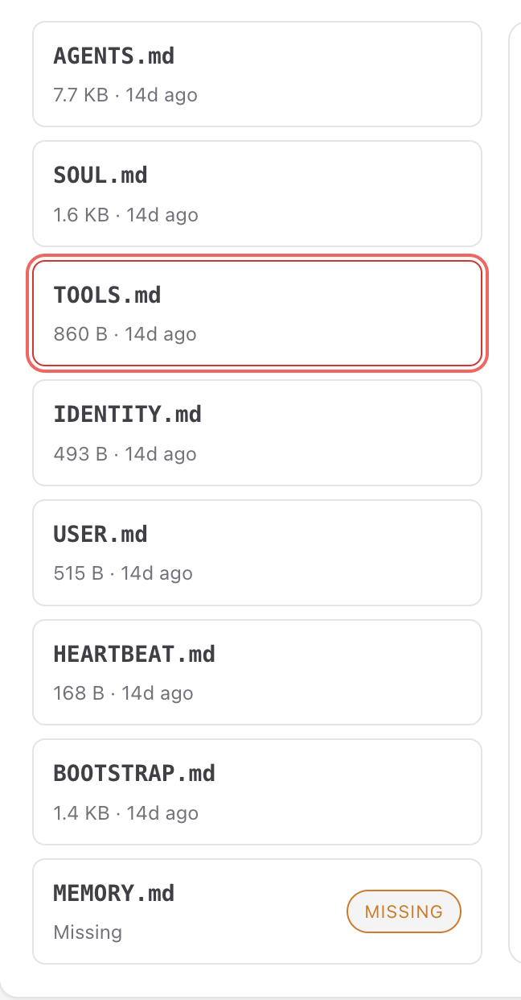

# OverView
```
User
  ↓
Core Gateway（控制平面）
  ↓
LLM Router  +  Skill Pipeline
  ↓
Execution Nodes（Browser / Device / Tools）
```

## Core Gateway
核心网关，在部署配置时也遇到过

## LLM Router + Skill Pipeline 
模型选择+ 插件化工具执行链

## Execution Nodes
执行层， 控制Browser/Mobile/本地系统操作


# 时间线
20260321
```
启动UImingl
openclaw dashboard --no-open

http://127.0.0.1:18789/ 
```
---
20260322

看了Hung-yi Lee 的以 OpenClaw 為例介紹 AI Agent 的運作原理
https://www.youtube.com/watch?v=2rcJdFuNbZQ&t=2s
 
主要是一个扫盲视频。结合视频看了下openclaw Ui 界面提供的功能，包括tools，skills，cron job。 基本上都是空白的，所以白板🦞只依赖模型本身的能力

还有Ui界面上的 File界面，包含了🦞最开始的system prompts
其中 Agents是这个agent要做的事情，包括阅读soul来识别身份信息，user是用户信息，Memory存储上下文，如何使用tools和skills，以及调用 hearbeat，当然，hearbeat本身也是一个prompt，当用户什么都没加时，它是空白的，但也支持一些自定义操作

--- 
