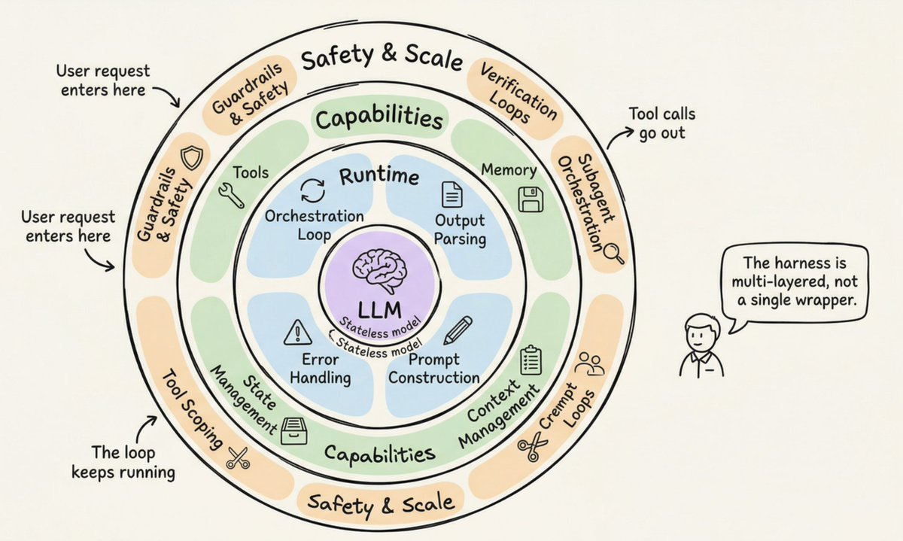
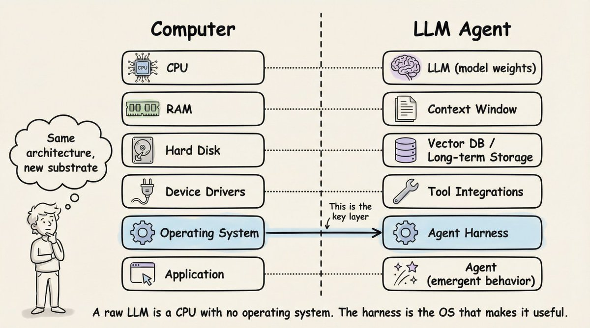
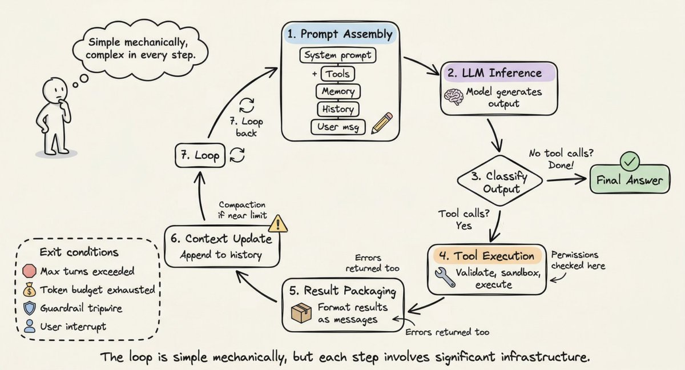
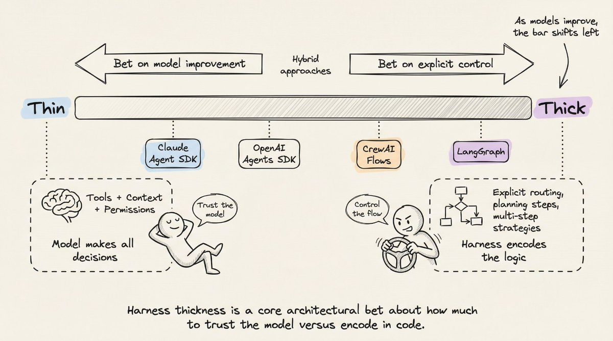

Harness表示着llm本身之外的全生态链路，从安全门户，上下文窗口，记忆模式，状态管理，工具调用，操作编排等众多方面使得llm从无状态到AI Agent的变化。

以下则是LLM以外的Harness构件与Computer在冯诺伊曼体系结构下的横向对比：
一个LLM像一个CPU，而其他的OS则就是Harness

一个完整的Harness Loop如下，Loop本身是简单的，但是每一步都有很多需要考虑的地方。

而harness本身也正在走向两个分化，Thin以Claude和OpenAI为代表，相信模型迭代的能力，更少的显示控制，让决定权交由Model本身。Thick则以Langgraph，CrewAI为代表，更多的route，plan等逻辑控制确保不出错。

