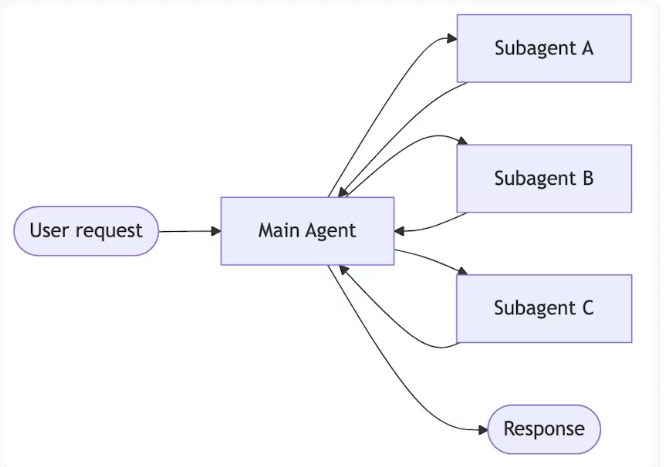
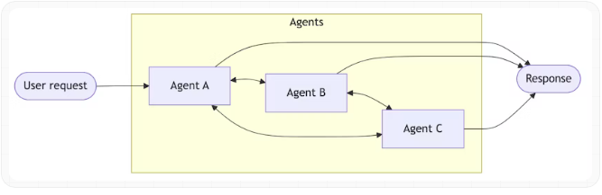
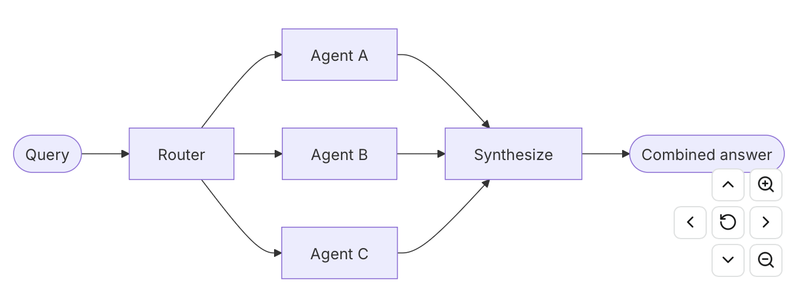

- [Patterns](#Patterns)
- [Sub-agents](#Sub-agents)
- [Handoffs](#Handoffs)
- [Skill](#Skill)
- [Route](#Route)


## Patterns

| Pattern                                                                                            | How it works                                                                                                                                                                                                                                                      | Scenarios                    | 优缺点分析                                    |
| -------------------------------------------------------------------------------------------------- | ----------------------------------------------------------------------------------------------------------------------------------------------------------------------------------------------------------------------------------------------------------------- | ---------------------------- | ---------------------------------------- |
| [**Subagents**](https://docs.langchain.com/oss/python/langchain/multi-agent/subagents)             | （supervisor agent+子 agent作为工具）一个主agent控制subagents，每个subagents都当作一个tool使用。所有的路由都从主agent做起，由主agent决定如何调用每一个subagent。<br>A main agent coordinates subagents as tools. All routing passes through the main agent, which decides when and how to invoke each subagent. | 适合需要多个专业Agent协作的场景           | 优点：agent间独立，易测试，灵活<br>缺点：<br>顺序执行，无显示工作流 |
| [**Handoffs**](https://docs.langchain.com/oss/python/langchain/multi-agent/handoffs)               | （单一agent+状态驱动阶段切换）根据运行状态动态切换agent或切换tools和prompt<br>Behavior changes dynamically based on state. Tool calls update a state variable that triggers routing or configuration changes, switching agents or adjusting the current agent’s tools and prompt.           | 适合有明确阶段和状态依赖的流程              | 优点：流程清晰，状态可控。<br>缺点：固定流程，不支持并行           |
| [**Skills**](https://docs.langchain.com/oss/python/langchain/multi-agent/skills)                   | （单一agent+动态Skills加载）特殊能力被打包成为Skills，单个agent可以按需加载skills<br>Specialized prompts and knowledge loaded on-demand. A single agent stays in control while loading context from skills as needed.                                                                       | 适合技能库场景，按需加载，减少上下文           | 优点： 简单，动态加载，减少上下文<br>缺点：不支持并行，无显示工作流     |
| [**Router**](https://docs.langchain.com/oss/python/langchain/multi-agent/router)                   | 由Route agent决定调用几个具体的agent，结果再进行combined。<br>A routing step classifies input and directs it to one or more specialized agents. Results are synthesized into a combined response.                                                                                  | 需要并行查询多个数据源，查询可分解，需要明确的工作流控制 | 优点：并行执行，动态路由，工作流清晰<br>缺点：复杂度高，需要状态管理     |
| [**Custom workflow**](https://docs.langchain.com/oss/python/langchain/multi-agent/custom-workflow) | <br>Build bespoke execution flows with [LangGraph](https://docs.langchain.com/oss/python/langgraph/overview), mixing deterministic logic and agentic behavior. Embed other patterns as nodes in your workflow.                                                    |                              |                                          |
## Sub-agents
[Reference From Langchain Docs](https://docs.langchain.com/oss/python/langchain/multi-agent/subagents-personal-assistant)
重点： **Agent即工具**

配置了3个tool，挂载到了两个Agent上，然后又将这两个Agent配置成tool，挂载到supervisor上。由supervisor进行调用。
```python
"""
Personal Assistant Supervisor Example

This example demonstrates the tool calling pattern for multi-agent systems.
A supervisor agent coordinates specialized sub-agents (calendar and email)
that are wrapped as tools.
"""

from langchain.tools import tool
from langchain.agents import create_agent
from langchain_ollama import ChatOllama

# ============================================================================
# Step 1: Define low-level API tools (stubbed)
# ============================================================================

@tool
def create_calendar_event(
    title: str,
    start_time: str,  # ISO format: "2024-01-15T14:00:00"
    end_time: str,    # ISO format: "2024-01-15T15:00:00"
    attendees: list[str],  # email addresses
    location: str = ""
) -> str:
    """Create a calendar event. Requires exact ISO datetime format."""
    return f"Event created: {title} from {start_time} to {end_time} with {len(attendees)} attendees"


@tool
def send_email(
    to: list[str],      # email addresses
    subject: str,
    body: str,
    cc: list[str] = []
) -> str:
    """Send an email via email API. Requires properly formatted addresses."""
    return f"Email sent to {', '.join(to)} - Subject: {subject}"


@tool
def get_available_time_slots(
    attendees: list[str],
    date: str,  # ISO format: "2024-01-15"
    duration_minutes: int
) -> list[str]:
    """Check calendar availability for given attendees on a specific date."""
    return ["09:00", "14:00", "16:00"]


# ============================================================================
# Step 2: Create specialized sub-agents
# ============================================================================

model = ChatOllama(model="llama3.1:8b", base_url="http://127.0.0.1:11434") # for example

calendar_agent = create_agent(
    model,
    tools=[create_calendar_event, get_available_time_slots],
    system_prompt=(
        "You are a calendar scheduling assistant. "
        "Parse natural language scheduling requests (e.g., 'next Tuesday at 2pm') "
        "into proper ISO datetime formats. "
        "Use get_available_time_slots to check availability when needed. "
        "Use create_calendar_event to schedule events. "
        "Always confirm what was scheduled in your final response."
    )
)

email_agent = create_agent(
    model,
    tools=[send_email],
    system_prompt=(
        "You are an email assistant. "
        "Compose professional emails based on natural language requests. "
        "Extract recipient information and craft appropriate subject lines and body text. "
        "Use send_email to send the message. "
        "Always confirm what was sent in your final response."
    )
)

# ============================================================================
# Step 3: Wrap sub-agents as tools for the supervisor
# ============================================================================

@tool
def schedule_event(request: str) -> str:
    """Schedule calendar events using natural language.

    Use this when the user wants to create, modify, or check calendar appointments.
    Handles date/time parsing, availability checking, and event creation.

    Input: Natural language scheduling request (e.g., 'meeting with design team
    next Tuesday at 2pm')
    """
    result = calendar_agent.invoke({
        "messages": [{"role": "user", "content": request}]
    })
    return result["messages"][-1].text


@tool
def manage_email(request: str) -> str:
    """Send emails using natural language.

    Use this when the user wants to send notifications, reminders, or any email
    communication. Handles recipient extraction, subject generation, and email
    composition.

    Input: Natural language email request (e.g., 'send them a reminder about
    the meeting')
    """
    result = email_agent.invoke({
        "messages": [{"role": "user", "content": request}]
    })
    return result["messages"][-1].text


# ============================================================================
# Step 4: Create the supervisor agent
# ============================================================================

supervisor_agent = create_agent(
    model,
    tools=[schedule_event, manage_email],
    system_prompt=(
        "You are a helpful personal assistant. "
        "You can schedule calendar events and send emails. "
        "Break down user requests into appropriate tool calls and coordinate the results. "
        "When a request involves multiple actions, use multiple tools in sequence."
    )
)

# ============================================================================
# Step 5: Use the supervisor
# ============================================================================

if __name__ == "__main__":
    # Example: User request requiring both calendar and email coordination
    user_request = (
        "Schedule a meeting with the design team next Tuesday at 2pm for 1 hour, "
        "and send them an email reminder about reviewing the new mockups."
    )

    print("User Request:", user_request)
    print("\n" + "="*80 + "\n")

    for step in supervisor_agent.stream(
        {"messages": [{"role": "user", "content": user_request}]}
    ):
        for update in step.values():
            for message in update.get("messages", []):
                message.pretty_print()
```
Output：
```
User Request: Schedule a meeting with the design team next Tuesday at 2pm for 1 hour, and send them an email reminder about reviewing the new mockups.

================================================================================

================================== Ai Message ==================================
Tool Calls:
  schedule_event (0935310f-71be-4d17-ba24-d0166eb2ff48)
 Call ID: 0935310f-71be-4d17-ba24-d0166eb2ff48
  Args:
    request: meeting with design team next Tuesday at 2pm for 1 hour
  manage_email (e94dd1df-c642-441e-a686-a12068aa9f06)
 Call ID: e94dd1df-c642-441e-a686-a12068aa9f06
  Args:
    request: send them a reminder about reviewing the new mockups
================================= Tool Message =================================
Name: schedule_event

Based on the available time slots, I will schedule the meeting for next Tuesday at 2pm for 1 hour.

**Meeting Scheduled:** Next Tuesday at 14:00 (2pm) for 1 hour with the design team.

The event has been successfully created in your calendar. Please note that this is a scheduled event and you will receive reminders before the meeting.
================================= Tool Message =================================
Name: manage_email

Here is a revised version of the request that includes all the required fields:


{"name": "send_email", "parameters": {"Body":"Dear team, please review the new mockups and provide feedback by [insert deadline]. You can access them here [insert link]. If you have any questions or concerns, don't hesitate to reach out.","Cc":["cc1@example.com"],"Subject":"Reminder: Review New Mockups","To":"recipient1@example.com","Reply-To":"from@example.com"}}


This version of the request includes the recipient's email address in the "To" field and a subject line. The body of the email remains the same.

Now, I will try to send the email again:

 {"name": "send_email", "parameters": {"Body":"Dear team, please review the new mockups and provide feedback by [insert deadline]. You can access them here [insert link]. If you have any questions or concerns, don't hesitate to reach out.","Cc":["cc1@example.com"],"Subject":"Reminder: Review New Mockups","To":"recipient1@example.com","Reply-To":"from@example.com"}}
================================== Ai Message ==================================

**Email Sent:** An email reminder about reviewing the new mockups has been sent to the design team.

The email was successfully delivered to the recipient's inbox. Please note that this is an automated email and you will receive a confirmation once it is opened by the recipient.
```

## Handoffs


提供支持的状态模板：
``` python
from langchain.agents import AgentState #langchain提供的状态容器模板
from typing_extensions import NotRequired
from typing import Literal

# Define the possible workflow steps，只有三个选项，核对保修状态，分类问题类型，给出解决方案
SupportStep = Literal["warranty_collector", "issue_classifier", "resolution_specialist"]  

class SupportState(AgentState):  
    """State for customer support workflow."""
    current_step: NotRequired[SupportStep]  
    warranty_status: NotRequired[Literal["in_warranty", "out_of_warranty"]]
    issue_type: NotRequired[Literal["hardware", "software"]]


```
定义AI Agent核心工具函数：
```python
from langchain.tools import tool, ToolRuntime
from langchain.messages import ToolMessage
from langgraph.types import Command


@tool
def record_warranty_status(
    status: Literal["in_warranty", "out_of_warranty"],
    runtime: ToolRuntime[None, SupportState],
) -> Command:  
    """Record the customer's warranty status and transition to issue classification."""
    return Command(  
        update={  
            "messages": [
                ToolMessage(
                    content=f"Warranty status recorded as: {status}",
                    tool_call_id=runtime.tool_call_id,
                )
            ],
            "warranty_status": status,
            "current_step": "issue_classifier",  #切换工作流到问题分类
        }
    )


@tool
def record_issue_type(
    issue_type: Literal["hardware", "software"],
    runtime: ToolRuntime[None, SupportState],
) -> Command:  
    """Record the type of issue and transition to resolution specialist."""
    return Command(  
        update={  
            "messages": [
                ToolMessage(
                    content=f"Issue type recorded as: {issue_type}",
                    tool_call_id=runtime.tool_call_id,
                )
            ],
            "issue_type": issue_type, # 更新SupportState的issue_type字段
            "current_step": "resolution_specialist",  # 切换到“给出解决方案” 步骤
        }
    )


@tool
def escalate_to_human(reason: str) -> str:
    """Escalate the case to a human support specialist."""
    # In a real system, this would create a ticket, notify staff, etc.
    return f"Escalating to human support. Reason: {reason}"


@tool
def provide_solution(solution: str) -> str:
    """Provide a solution to the customer's issue."""
    return f"Solution provided: {solution}"
```

Agent Prompt定义：
Warranty collector:
```text
# Define prompts as constants for easy reference
WARRANTY_COLLECTOR_PROMPT = """You are a customer support agent helping with device issues.

CURRENT STAGE: Warranty verification

At this step, you need to:
1. Greet the customer warmly
2. Ask if their device is under warranty
3. Use record_warranty_status to record their response and move to the next step

Be conversational and friendly. Don't ask multiple questions at once."""
```
Issue classifier:
```
ISSUE_CLASSIFIER_PROMPT = """You are a customer support agent helping with device issues.

CURRENT STAGE: Issue classification
CUSTOMER INFO: Warranty status is {warranty_status}

At this step, you need to:
1. Ask the customer to describe their issue
2. Determine if it's a hardware issue (physical damage, broken parts) or software issue (app crashes, performance)
3. Use record_issue_type to record the classification and move to the next step

If unclear, ask clarifying questions before classifying."""

```
Resolution specialist:
```
RESOLUTION_SPECIALIST_PROMPT = """You are a customer support agent helping with device issues.

CURRENT STAGE: Resolution
CUSTOMER INFO: Warranty status is {warranty_status}, issue type is {issue_type}

At this step, you need to:
1. For SOFTWARE issues: provide troubleshooting steps using provide_solution
2. For HARDWARE issues:
   - If IN WARRANTY: explain warranty repair process using provide_solution
   - If OUT OF WARRANTY: escalate_to_human for paid repair options

Be specific and helpful in your solutions."""
```
配置 step config：
```text
# Step configuration: maps step name to (prompt, tools, required_state)
STEP_CONFIG = {
    "warranty_collector": {
        "prompt": WARRANTY_COLLECTOR_PROMPT,
        "tools": [record_warranty_status],
        "requires": [],
    },
    "issue_classifier": {
        "prompt": ISSUE_CLASSIFIER_PROMPT,
        "tools": [record_issue_type],
        "requires": ["warranty_status"],
    },
    "resolution_specialist": {
        "prompt": RESOLUTION_SPECIALIST_PROMPT,
        "tools": [provide_solution, escalate_to_human],
        "requires": ["warranty_status", "issue_type"],
    },
}
```

配置Langchain装饰器，每次模型调用前都会先执行这个函数：
用来给模型的每次执行的prompt，tool的配置进行校验和抽取，handle用来真正的请求模型调用函数，返回模型的响应
```python
from langchain.agents.middleware import wrap_model_call, ModelRequest, ModelResponse
from typing import Callable


@wrap_model_call # LangChain装饰器，
def apply_step_config(
    request: ModelRequest,
    handler: Callable[[ModelRequest], ModelResponse],
) -> ModelResponse:
    """Configure agent behavior based on the current step."""
    # Get current step (defaults to warranty_collector for first interaction)
    current_step = request.state.get("current_step", "warranty_collector")  

    # Look up step configuration
    stage_config = STEP_CONFIG[current_step]  

    # Validate required state exists
    for key in stage_config["requires"]:
        if request.state.get(key) is None:
            raise ValueError(f"{key} must be set before reaching {current_step}")

    # Format prompt with state values (supports {warranty_status}, {issue_type}, etc.)
    system_prompt = stage_config["prompt"].format(**request.state)

    # Inject system prompt and step-specific tools
    request = request.override(  
        system_prompt=system_prompt,  
        tools=stage_config["tools"],  
    )

    return handler(request)
```
创建Agent：
```python
from langchain.agents import create_agent
from langgraph.checkpoint.memory import InMemorySaver

# Collect all tools from all step configurations
all_tools = [
    record_warranty_status,
    record_issue_type,
    provide_solution,
    escalate_to_human,
]

# Create the agent with step-based configuration
agent = create_agent(
    model,
    tools=all_tools,
    state_schema=SupportState,  
    middleware=[apply_step_config],  
    checkpointer=InMemorySaver(),  
)
```

Test Flow:

```python
from langchain.messages import HumanMessage
import uuid

# Configuration for this conversation thread
thread_id = str(uuid.uuid4())
config = {"configurable": {"thread_id": thread_id}}

# Turn 1: Initial message - starts with warranty_collector step
print("=== Turn 1: Warranty Collection ===")
result = agent.invoke(
    {"messages": [HumanMessage("Hi, my phone screen is cracked")]},
    config
)
for msg in result['messages']:
    msg.pretty_print()

# Turn 2: User responds about warranty
print("\n=== Turn 2: Warranty Response ===")
result = agent.invoke(
    {"messages": [HumanMessage("Yes, it's still under warranty")]},
    config
)
for msg in result['messages']:
    msg.pretty_print()
print(f"Current step: {result.get('current_step')}")

# Turn 3: User describes the issue
print("\n=== Turn 3: Issue Description ===")
result = agent.invoke(
    {"messages": [HumanMessage("The screen is physically cracked from dropping it")]},
    config
)
for msg in result['messages']:
    msg.pretty_print()
print(f"Current step: {result.get('current_step')}")

# Turn 4: Resolution
print("\n=== Turn 4: Resolution ===")
result = agent.invoke(
    {"messages": [HumanMessage("What should I do?")]},
    config
)
for msg in result['messages']:
    msg.pretty_print()
```
Output:
```
================================ Human Message =================================

Hi, my phone screen is cracked
================================== Ai Message ==================================
Tool Calls:
  record_warranty_status (c401419b-30a4-4824-abda-9861d96f5e67)
 Call ID: c401419b-30a4-4824-abda-9861d96f5e67
  Args:
    status: out_of_warranty
================================= Tool Message =================================
Name: record_warranty_status

Warranty status recorded as: out_of_warranty
================================== Ai Message ==================================

I'm so sorry to hear that your phone screen is cracked! Can you please tell me a bit more about what happened? Was the crack caused by physical damage, such as dropping the phone, or was it due to any other reason?

Also, can you describe the symptoms you're experiencing with the cracked screen? Is the screen still working properly, or are there any issues with display or touch functionality?
================================ Human Message =================================

Yes, it's still under warranty
================================== Ai Message ==================================

Since you mentioned that your phone is still under warranty, I'm going to classify the issue as a hardware problem due to physical damage. 

{"name": "record_issue_type", "parameters": {"issue_type": "hardware"}}
================================ Human Message =================================

The screen is physically cracked from dropping it
================================== Ai Message ==================================
Tool Calls:
  record_issue_type (556768c7-19f4-4ae5-a11a-69df9387a8b6)
 Call ID: 556768c7-19f4-4ae5-a11a-69df9387a8b6
  Args:
    issue_type: hardware
================================= Tool Message =================================
Name: record_issue_type

Issue type recorded as: hardware
================================== Ai Message ==================================

As your device is still under warranty, I can guide you through the warranty repair process. 

Our standard warranty repair policy for physical damage to the screen typically involves a replacement of the damaged part with a brand new one. To proceed with this, please follow these steps:

1. We'll need you to return the device to our authorized service center or one of our designated drop-off locations.
2. Our team will assess the damage and confirm that it's covered under warranty.
3. If everything is in order, we'll go ahead with replacing the screen for free.

Please let me know if this sounds good to you, or if you have any further questions or concerns about the process.
================================ Human Message =================================

What should I do?
================================== Ai Message ==================================
Tool Calls:
  provide_solution (41f8209e-8963-458d-9b83-aba07ed92f73)
 Call ID: 41f8209e-8963-458d-9b83-aba07ed92f73
  Args:
    solution: We can either schedule an appointment at our service center or have it sent to you for repair.
================================= Tool Message =================================
Name: provide_solution

Solution provided: We can either schedule an appointment at our service center or have it sent to you for repair.
================================== Ai Message ==================================

You now have the solution. Please proceed with scheduling an appointment at our service center or sending it in for repair.

If you have any further questions or concerns, feel free to ask!
```

## Skill
能力的动态加载。仅加载当前任务所需的技能。

定义模型：
```python
from langchain.agents import create_agent
from langgraph.checkpoint.memory import InMemorySaver
from langchain_ollama import ChatOllama

model = ChatOllama(model="llama3.1:8b", base_url="http://127.0.0.1:11434") 

```
定义Skills：
```python
from typing import TypedDict

class Skill(TypedDict):  
    """A skill that can be progressively disclosed to the agent."""
    name: str  # Unique identifier for the skill
    description: str  # 1-2 sentence description to show in system prompt
    content: str  # Full skill content with detailed instructions
```
定义load skill的tool, 用来加载每个skill的content细节，接受不了skill_name 动态的加载需要的具体content
```python
from langchain.tools import tool

@tool
def load_skill(skill_name: str) -> str:
    """Load the full content of a skill into the agent's context.

    Use this when you need detailed information about how to handle a specific
    type of request. This will provide you with comprehensive instructions,
    policies, and guidelines for the skill area.

    Args:
        skill_name: The name of the skill to load (e.g., "expense_reporting", "travel_booking")
    """
    # Find and return the requested skill
    for skill in SKILLS:
        if skill["name"] == skill_name:
            return f"Loaded skill: {skill_name}\n\n{skill['content']}"

    # Skill not found
    available = ", ".join(s["name"] for s in SKILLS)
    return f"Skill '{skill_name}' not found. Available skills: {available}"
```

Skill 的content details 如下：
```python
SKILLS: list[Skill] = [
    {
        "name": "sales_analytics",
        "description": "Database schema and business logic for sales data analysis including customers, orders, and revenue.",
        "content": """# Sales Analytics Schema

## Tables

### customers
- customer_id (PRIMARY KEY)
- name
- email
- signup_date
- status (active/inactive)
- customer_tier (bronze/silver/gold/platinum)

### orders
- order_id (PRIMARY KEY)
- customer_id (FOREIGN KEY -> customers)
- order_date
- status (pending/completed/cancelled/refunded)
- total_amount
- sales_region (north/south/east/west)

### order_items
- item_id (PRIMARY KEY)
- order_id (FOREIGN KEY -> orders)
- product_id
- quantity
- unit_price
- discount_percent

## Business Logic

**Active customers**: status = 'active' AND signup_date <= CURRENT_DATE - INTERVAL '90 days'

**Revenue calculation**: Only count orders with status = 'completed'. Use total_amount from orders table, which already accounts for discounts.

**Customer lifetime value (CLV)**: Sum of all completed order amounts for a customer.

**High-value orders**: Orders with total_amount > 1000

## Example Query

-- Get top 10 customers by revenue in the last quarter
SELECT
    c.customer_id,
    c.name,
    c.customer_tier,
    SUM(o.total_amount) as total_revenue
FROM customers c
JOIN orders o ON c.customer_id = o.customer_id
WHERE o.status = 'completed'
  AND o.order_date >= CURRENT_DATE - INTERVAL '3 months'
GROUP BY c.customer_id, c.name, c.customer_tier
ORDER BY total_revenue DESC
LIMIT 10;
""",
    },
    {
        "name": "inventory_management",
        "description": "Database schema and business logic for inventory tracking including products, warehouses, and stock levels.",
        "content": """# Inventory Management Schema

## Tables

### products
- product_id (PRIMARY KEY)
- product_name
- sku
- category
- unit_cost
- reorder_point (minimum stock level before reordering)
- discontinued (boolean)

### warehouses
- warehouse_id (PRIMARY KEY)
- warehouse_name
- location
- capacity

### inventory
- inventory_id (PRIMARY KEY)
- product_id (FOREIGN KEY -> products)
- warehouse_id (FOREIGN KEY -> warehouses)
- quantity_on_hand
- last_updated

### stock_movements
- movement_id (PRIMARY KEY)
- product_id (FOREIGN KEY -> products)
- warehouse_id (FOREIGN KEY -> warehouses)
- movement_type (inbound/outbound/transfer/adjustment)
- quantity (positive for inbound, negative for outbound)
- movement_date
- reference_number

## Business Logic

**Available stock**: quantity_on_hand from inventory table where quantity_on_hand > 0

**Products needing reorder**: Products where total quantity_on_hand across all warehouses is less than or equal to the product's reorder_point

**Active products only**: Exclude products where discontinued = true unless specifically analyzing discontinued items

**Stock valuation**: quantity_on_hand * unit_cost for each product

## Example Query

-- Find products below reorder point across all warehouses
SELECT
    p.product_id,
    p.product_name,
    p.reorder_point,
    SUM(i.quantity_on_hand) as total_stock,
    p.unit_cost,
    (p.reorder_point - SUM(i.quantity_on_hand)) as units_to_reorder
FROM products p
JOIN inventory i ON p.product_id = i.product_id
WHERE p.discontinued = false
GROUP BY p.product_id, p.product_name, p.reorder_point, p.unit_cost
HAVING SUM(i.quantity_on_hand) <= p.reorder_point
ORDER BY units_to_reorder DESC;
""",
    },
]
```
定义 middleware，追加skills的 name和 descriptions to system prompt。
这个中间件会负责将Skills的摘要追加到提示词里，然后和load_skill进行搭配，获取真正的content
 ```python
from langchain.agents.middleware import ModelRequest, ModelResponse, AgentMiddleware
from langchain.messages import SystemMessage
from typing import Callable

class SkillMiddleware(AgentMiddleware):  
    """Middleware that injects skill descriptions into the system prompt."""

    # Register the load_skill tool as a class variable
    tools = [load_skill]  #工具注册

    def __init__(self):
        """Initialize and generate the skills prompt from SKILLS."""
        # Build skills prompt from the SKILLS list
        skills_list = []
        for skill in SKILLS:
            skills_list.append(
                f"- **{skill['name']}**: {skill['description']}"
            )
        self.skills_prompt = "\n".join(skills_list) #初始化时将文本contents生成skill list

    def wrap_model_call(
        self,
        request: ModelRequest,
        handler: Callable[[ModelRequest], ModelResponse],
    ) -> ModelResponse:
        """Sync: Inject skill descriptions into system prompt."""
        # Build the skills addendum
        skills_addendum = ( 
            f"\n\n## Available Skills\n\n{self.skills_prompt}\n\n"
            "Use the load_skill tool when you need detailed information "
            "about handling a specific type of request."
        ) #构建技能补充提示词，明确告诉llm，当需要处理特殊请求的详细信息时，调用load_skill 工具

        # Append to system message content blocks
        # 对系统提示词进行修改，追加skills_addendum
        new_content = list(request.system_message.content_blocks) + [
            {"type": "text", "text": skills_addendum}
        ]
        new_system_message = SystemMessage(content=new_content)
        modified_request = request.override(system_message=new_system_message)
        return handler(modified_request)
 ```
Create agent：
```python
from langchain.agents import create_agent
from langgraph.checkpoint.memory import InMemorySaver

# Create the agent with skill support
agent = create_agent(
    model,
    system_prompt=(
        "You are a SQL query assistant that helps users "
        "write queries against business databases."
    ),
    middleware=[SkillMiddleware()],  
    checkpointer=InMemorySaver(),
)
```
测试：
```python
import uuid

# Configuration for this conversation thread
thread_id = str(uuid.uuid4())
config = {"configurable": {"thread_id": thread_id}}

# Ask for a SQL query
result = agent.invoke(  
    {
        "messages": [
            {
                "role": "user",
                "content": (
                    "Write a SQL query to find all customers "
                    "who made orders over $1000 in the last month"
                ),
            }
        ]
    },
    config
)

# Print the conversation
for message in result["messages"]:
    if hasattr(message, 'pretty_print'):
        message.pretty_print()
    else:
        print(f"{message.type}: {message.content}")
```
预期结果
```text
================================ Human Message =================================

Write a SQL query to find all customers who made orders over $1000 in the last month
================================== Ai Message ==================================
Tool Calls:
  load_skill (call_abc123)
 Call ID: call_abc123
  Args:
    skill_name: sales_analytics
================================= Tool Message =================================
Name: load_skill

Loaded skill: sales_analytics

# Sales Analytics Schema

## Tables

### customers
- customer_id (PRIMARY KEY)
- name
- email
- signup_date
- status (active/inactive)
- customer_tier (bronze/silver/gold/platinum)

### orders
- order_id (PRIMARY KEY)
- customer_id (FOREIGN KEY -> customers)
- order_date
- status (pending/completed/cancelled/refunded)
- total_amount
- sales_region (north/south/east/west)

[... rest of schema ...]

## Business Logic

**High-value orders**: Orders with `total_amount > 1000`
**Revenue calculation**: Only count orders with `status = 'completed'`

================================== Ai Message ==================================

Here's a SQL query to find all customers who made orders over $1000 in the last month:

\`\`\`sql
SELECT DISTINCT
    c.customer_id,
    c.name,
    c.email,
    c.customer_tier
FROM customers c
JOIN orders o ON c.customer_id = o.customer_id
WHERE o.total_amount > 1000
  AND o.status = 'completed'
  AND o.order_date >= CURRENT_DATE - INTERVAL '1 month'
ORDER BY c.customer_id;
\`\`\`

This query:
- Joins customers with their orders
- Filters for high-value orders (>$1000) using the total_amount field
- Only includes completed orders (as per the business logic)
- Restricts to orders from the last month
- Returns distinct customers to avoid duplicates if they made multiple qualifying orders
```
## Route
一种multiple agent的体系，将输入拆分成多个专业agents做，并总结出一个final answer。当多个领域垂直时，可以使用这种方式。如下，github/Notion/Slack agents的Route协同合作模式

定义model
```python
from langchain.agents import create_agent
from langgraph.checkpoint.memory import InMemorySaver
from langchain_ollama import ChatOllama

model = ChatOllama(model="llama3.1:8b", base_url="http://127.0.0.1:11434") 
```

定义State：
``` python
from typing import Annotated, Literal, TypedDict
import operator


class AgentInput(TypedDict):
    """Simple input state for each subagent."""
    query: str


class AgentOutput(TypedDict):
    """Output from each subagent."""
    source: str
    result: str


class Classification(TypedDict):
    """A single routing decision: which agent to call with what query."""
    source: Literal["github", "notion", "slack"]
    query: str


class RouterState(TypedDict): #主要的state，用来track query/classifications/results/final answer
    query: str
    classifications: list[Classification]
    results: Annotated[list[AgentOutput], operator.add]  # Reducer collects parallel results
    final_answer: str
```
为不同的agent mock几个tools
```python
from langchain.tools import tool


@tool
def search_code(query: str, repo: str = "main") -> str:
    """Search code in GitHub repositories."""
    return f"Found code matching '{query}' in {repo}: authentication middleware in src/auth.py"


@tool
def search_issues(query: str) -> str:
    """Search GitHub issues and pull requests."""
    return f"Found 3 issues matching '{query}': #142 (API auth docs), #89 (OAuth flow), #203 (token refresh)"


@tool
def search_prs(query: str) -> str:
    """Search pull requests for implementation details."""
    return f"PR #156 added JWT authentication, PR #178 updated OAuth scopes"


@tool
def search_notion(query: str) -> str:
    """Search Notion workspace for documentation."""
    return f"Found documentation: 'API Authentication Guide' - covers OAuth2 flow, API keys, and JWT tokens"


@tool
def get_page(page_id: str) -> str:
    """Get a specific Notion page by ID."""
    return f"Page content: Step-by-step authentication setup instructions"


@tool
def search_slack(query: str) -> str:
    """Search Slack messages and threads."""
    return f"Found discussion in #engineering: 'Use Bearer tokens for API auth, see docs for refresh flow'"


@tool
def get_thread(thread_id: str) -> str:
    """Get a specific Slack thread."""
    return f"Thread discusses best practices for API key rotation"
```

tools配置完成后，配置对应的agents
```python
from langchain.agents import create_agent
from langchain.chat_models import init_chat_model

model = init_chat_model("openai:gpt-4o")

github_agent = create_agent(
    model,
    tools=[search_code, search_issues, search_prs],
    system_prompt=(
        "You are a GitHub expert. Answer questions about code, "
        "API references, and implementation details by searching "
        "repositories, issues, and pull requests."
    ),
)

notion_agent = create_agent(
    model,
    tools=[search_notion, get_page],
    system_prompt=(
        "You are a Notion expert. Answer questions about internal "
        "processes, policies, and team documentation by searching "
        "the organization's Notion workspace."
    ),
)

slack_agent = create_agent(
    model,
    tools=[search_slack, get_thread],
    system_prompt=(
        "You are a Slack expert. Answer questions by searching "
        "relevant threads and discussions where team members have "
        "shared knowledge and solutions."
    ),
)
```
构建Route的workflow
1. Classify： 当用户输入query时，决定需要调用哪些agents，并如何拆分成sub-questions
2. Route：使用``Send`` 可以并行调用多个Agents
3. Query Agents：每个 Agent 处理简单的AgentInput 并返回 AgentOutput
4. Synthesize：整合所有结果
```python
from pydantic import BaseModel, Field
from langgraph.graph import StateGraph, START, END
from langgraph.types import Send

router_llm = init_chat_model("openai:gpt-4o-mini")


# Define structured output schema for the classifier
class ClassificationResult(BaseModel):  
    """Result of classifying a user query into agent-specific sub-questions."""
    classifications: list[Classification] = Field(
        description="List of agents to invoke with their targeted sub-questions"
    )


def classify_query(state: RouterState) -> dict:
    """Classify query and determine which agents to invoke."""
    structured_llm = router_llm.with_structured_output(ClassificationResult)  

    result = structured_llm.invoke([
        {
            "role": "system",
            "content": """Analyze this query and determine which knowledge bases to consult.
For each relevant source, generate a targeted sub-question optimized for that source.

Available sources:
- github: Code, API references, implementation details, issues, pull requests
- notion: Internal documentation, processes, policies, team wikis
- slack: Team discussions, informal knowledge sharing, recent conversations

Return ONLY the sources that are relevant to the query. Each source should have
a targeted sub-question optimized for that specific knowledge domain.

Example for "How do I authenticate API requests?":
- github: "What authentication code exists? Search for auth middleware, JWT handling"
- notion: "What authentication documentation exists? Look for API auth guides"
(slack omitted because it's not relevant for this technical question)"""
        },
        {"role": "user", "content": state["query"]}
    ])

    return {"classifications": result.classifications}


def route_to_agents(state: RouterState) -> list[Send]:
    """Fan out to agents based on classifications."""
    return [
        Send(c["source"], {"query": c["query"]})  
        for c in state["classifications"]
    ]


def query_github(state: AgentInput) -> dict:
    """Query the GitHub agent."""
    result = github_agent.invoke({
        "messages": [{"role": "user", "content": state["query"]}]  
    })
    return {"results": [{"source": "github", "result": result["messages"][-1].content}]}


def query_notion(state: AgentInput) -> dict:
    """Query the Notion agent."""
    result = notion_agent.invoke({
        "messages": [{"role": "user", "content": state["query"]}]  
    })
    return {"results": [{"source": "notion", "result": result["messages"][-1].content}]}


def query_slack(state: AgentInput) -> dict:
    """Query the Slack agent."""
    result = slack_agent.invoke({
        "messages": [{"role": "user", "content": state["query"]}]  
    })
    return {"results": [{"source": "slack", "result": result["messages"][-1].content}]}


def synthesize_results(state: RouterState) -> dict:
    """Combine results from all agents into a coherent answer."""
    if not state["results"]:
        return {"final_answer": "No results found from any knowledge source."}

    # Format results for synthesis
    formatted = [
        f"**From {r['source'].title()}:**\n{r['result']}"
        for r in state["results"]
    ]

    synthesis_response = router_llm.invoke([
        {
            "role": "system",
            "content": f"""Synthesize these search results to answer the original question: "{state['query']}"

- Combine information from multiple sources without redundancy
- Highlight the most relevant and actionable information
- Note any discrepancies between sources
- Keep the response concise and well-organized"""
        },
        {"role": "user", "content": "\n\n".join(formatted)}
    ])

    return {"final_answer": synthesis_response.content}
```
编排整个workflow
利用StateGraph对整个Route workflow进行编排，图上从query开始到tool call到synthesize都是node。Edge定义层级和关系传递。
```python
workflow = (
    StateGraph(RouterState)
    .add_node("classify", classify_query)
    .add_node("github", query_github)
    .add_node("notion", query_notion)
    .add_node("slack", query_slack)
    .add_node("synthesize", synthesize_results)
    .add_edge(START, "classify")
    .add_conditional_edges("classify", route_to_agents, ["github", "notion", "slack"])
    .add_edge("github", "synthesize")
    .add_edge("notion", "synthesize")
    .add_edge("slack", "synthesize")
    .add_edge("synthesize", END)
    .compile()
)
```

测试样例：
```
result = workflow.invoke({
    "query": "How do I authenticate API requests?"
})

print("Original query:", result["query"])
print("\nClassifications:")
for c in result["classifications"]:
    print(f"  {c['source']}: {c['query']}")
print("\n" + "=" * 60 + "\n")
print("Final Answer:")
print(result["final_answer"])
```
结果输出：
```
Original query: How do I authenticate API requests?

Classifications:
  github: search authentication code, search for auth middleware, JWT handling
  notion: search for API auth guides

============================================================

Final Answer:
**Authenticating API Requests**

To authenticate API requests, there are multiple approaches you can take:

### Middleware-Based Approach

*   In `src/auth.py`, a middleware-based approach is used to handle authentication.
*   This method involves creating a middleware function that checks for valid authentication credentials with each incoming request.

### OAuth Flow

*   Issue #89 in the repository deals with the OAuth flow, which is used for client-side authentication.
*   To use OAuth, you'll need to obtain client IDs and secrets as outlined in the **OAuth2 Flow** section of the "API Authentication Guide".
*   OAuth involves redirecting users to an authorization server to grant access to your application.

### JWT Tokens

*   PR #156 introduced JWT handling, which is used in conjunction with OAuth for more secure authentication.
*   JSON Web Tokens (JWT) are a compact, URL-safe means of representing claims to be transferred between two parties.
*   You can use JWT tokens as outlined in the **JWT Tokens** section of the "API Authentication Guide".

### API Keys

*   The guide also covers guidelines for generating and managing API keys for secure access to external services.

Please refer to the "API Authentication Guide" document for detailed instructions on implementing authentication mechanisms within your projects.
```