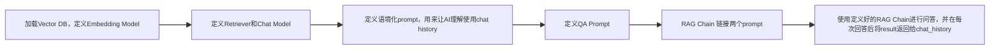

RAG（检索-增强-生成）
通过额外的Doc编码到Vector DB，结合用户输入的query进行相似性搜索。
- [RAG Basic](#RAG%20Basic)
- [RAG Basic metadata](#RAG%20Basic%20metadata)
- [RAG Text Embedding](#RAG%20Text%20Embedding)
- [RAG Retriever](#RAG%20Retriever)
- [RAG Conversational](#RAG%20Conversational)
- [RAG with Web scrape Basic](#RAG%20with%20Web%20scrape%20Basic)
- [RAG WEB scrape with firecrawl](#RAG%20WEB%20scrape%20with%20firecrawl)

## RAG Basic

Code 1: load additional doc to Vector database.
```python
import os

from langchain.text_splitter import CharacterTextSplitter
from langchain_community.document_loaders import TextLoader
from langchain_community.vectorstores import Chroma
from langchain_openai import OpenAIEmbeddings
from langchain_ollama import OllamaEmbeddings

# Define the directory containing the text file and the persistent directory
current_dir = os.path.dirname(os.path.abspath(__file__))
file_path = os.path.join(current_dir, "books", "odyssey.txt")
persistent_directory = os.path.join(current_dir, "db", "chroma_db")

# Check if the Chroma vector store already exists
if not os.path.exists(persistent_directory):
    print("Persistent directory does not exist. Initializing vector store...")

    # Ensure the text file exists
    if not os.path.exists(file_path):
        raise FileNotFoundError(
            f"The file {file_path} does not exist. Please check the path."
        )

    # Read the text content from the file
    loader = TextLoader(file_path)
    documents = loader.load()

    # Split the document into chunks
    # Define chunk size and if there is overlap needed to ensure context is maintained
    text_splitter = CharacterTextSplitter(chunk_size=1000, chunk_overlap=0)
    docs = text_splitter.split_documents(documents)

    # Display information about the split documents
    print("\n--- Document Chunks Information ---")
    print(f"Number of document chunks: {len(docs)}")
    print(f"Sample chunk:\n{docs[0].page_content}\n")

    # Create embeddings
    print("\n--- Creating embeddings ---")
    
    embeddings = OllamaEmbeddings(
        model="nomic-embed-text"
    )  # Update to a valid embedding model if needed
    print("\n--- Finished creating embeddings ---")

    # Create the vector store and persist it automatically！！！！
    print("\n--- Creating vector store ---")
    db = Chroma.from_documents(
        docs, embeddings, persist_directory=persistent_directory)
    print("\n--- Finished creating vector store ---")

else:
    print("Vector store already exists. No need to initialize.")

```

Code 2:

```python
import os

from langchain_community.vectorstores import Chroma
from langchain_openai import OpenAIEmbeddings
from langchain_ollama import OllamaEmbeddings

# Define the persistent directory
current_dir = os.path.dirname(os.path.abspath(__file__))
persistent_directory = os.path.join(current_dir, "db", "chroma_db")

# Define the embedding model
embeddings = OllamaEmbeddings(model="nomic-embed-text")

# Load the existing vector store with the embedding function
db = Chroma(persist_directory=persistent_directory,
            embedding_function=embeddings)

# Define the user's question
query = "Who is Odysseus' wife?"

# Retrieve relevant documents based on the query
# Similarity search top 3 results which score threshold are greater than 0,3
retriever = db.as_retriever(
    search_type="similarity_score_threshold",
    search_kwargs={"k": 3, "score_threshold": 0.3},
)
relevant_docs = retriever.invoke(query)

# Display the relevant results with metadata
print("\n--- Relevant Documents ---")
for i, doc in enumerate(relevant_docs, 1):
    print(f"Document {i}:\n{doc.page_content}\n")
    if doc.metadata:
        print(f"Source: {doc.metadata.get('source', 'Unknown')}\n")

```

Output:
``` text
Persistent directory does not exist. Initializing vector store...
--- Document Chunks Information ---
Number of document chunks: 826
--- Creating embeddings ---
--- Finished creating embeddings ---
--- Creating vector store ---
--- Finished creating vector store ---
-----------------
--- Relevant Documents ---
Document 1:
Now all the rest, as many as fled from sheer destruction, were at
    home, and had escaped both war and sea, but Odysseus only, craving
    for his wife and for his homeward path, the lady nymph Calypso
Document 2:
“Then he dived under the sea, and she in due course bore Pelias and
Neleus, who both of them served Jove with all their might. Pelias was a
great breeder of sheep and lived in Iolcus, but the other lived in
Document 3:
“Neptune, however, lay with his daughter, and she had a son by him, the
great Nausithous, who reigned over the Phaeacians. Nausithous had two
sons Rhexenor and Alcinous;58 Apollo killed the first of them while he
```

## RAG Basic metadata
Metadata可以用来给文档提供隐形的骨架，提升检索的精度，增强结果的可信度，支持复杂的业务逻辑
```python

    # Read the text content from each file and store it with metadata
    documents = []
    for book_file in book_files:
        file_path = os.path.join(books_dir, book_file)
        loader = TextLoader(file_path)
        book_docs = loader.load()
        for doc in book_docs:
            # Add metadata to each document indicating its source
            doc.metadata = {"source": book_file}
            documents.append(doc)

    # Split the documents into chunks
    text_splitter = CharacterTextSplitter(chunk_size=1000, chunk_overlap=0)
    docs = text_splitter.split_documents(documents)
```

## RAG Text Embedding
不同的Splitting分割方式会有不同的特点，
通用场景下 Recursive CharacterTextSplitter会更常用一些

| **分割方式**                                         | **原理**                                     | **适用场景**                 | **优点**        | **缺点**             |
| ------------------------------------------------ | ------------------------------------------ | ------------------------ | ------------- | ------------------ |
| **字符分割**  <br>（`CharacterTextSplitter`）          | 按固定字符数（如500字符）分割，可设置重叠（overlap）。           | 通用文本、无明确结构的文档（如日志）       | 简单高效，适合任意文本   | 可能切断完整句子或段落        |
| **递归分割**  <br>（`RecursiveCharacterTextSplitter`） | 按层级分隔符（如`\n\n` > `\n` > 空格）递归分割，优先保持段落完整性。 | 结构化文档（Markdown、PDF、HTML） | 保留语义边界，减少信息割裂 | 对无格式纯文本效果一般        |
| **句子分割**  <br>（`SentenceSplitter`）               | 按句号、问号等标点分割句子。                             | 问答系统、语义分析                | 句子级语义完整性高     | 依赖标点质量，长句可能仍超限     |
| **Token分割**  <br>（`TokenTextSplitter`）           | 按模型Token数（如LLM的512 Token限制）分割。             | 需严格匹配模型上下文窗口（如GPT-4）     | 避免截断模型输入      | 计算成本高，需调用Tokenizer |
| **语义分割**  <br>（`SemanticChunker`）                | 基于嵌入向量相似度动态分割（相邻文本相似度低时切分）。                | 高精度语义检索（如学术论文）           | 分割结果与语义强相关    | 计算开销大，需嵌入模型支持      |
| **固定块分割**  <br>（`FixedSizeChunking`）             | 严格按固定块数（如10块）均分文档。                         | 需均匀分块的场景（如法律条款比对）        | 结果可预测         | 完全忽略文本结构           |
```python
# 1. Character-based Splitting
# Splits text into chunks based on a specified number of characters.
# Useful for consistent chunk sizes regardless of content structure.
print("\n--- Using Character-based Splitting ---")
char_splitter = CharacterTextSplitter(chunk_size=1000, chunk_overlap=100)
char_docs = char_splitter.split_documents(documents)
create_vector_store(char_docs, "chroma_db_char")

# 2. Sentence-based Splitting
# Splits text into chunks based on sentences, ensuring chunks end at sentence boundaries.
# Ideal for maintaining semantic coherence within chunks.
print("\n--- Using Sentence-based Splitting ---")
sent_splitter = SentenceTransformersTokenTextSplitter(chunk_size=1000)
sent_docs = sent_splitter.split_documents(documents)
create_vector_store(sent_docs, "chroma_db_sent")

# 3. Token-based Splitting
# Splits text into chunks based on tokens (words or subwords), using tokenizers like GPT-2.
# Useful for transformer models with strict token limits.
print("\n--- Using Token-based Splitting ---")
token_splitter = TokenTextSplitter(chunk_overlap=0, chunk_size=512)
token_docs = token_splitter.split_documents(documents)
create_vector_store(token_docs, "chroma_db_token")

# 4. Recursive Character-based Splitting
# Attempts to split text at natural boundaries (sentences, paragraphs) within character limit.
# Balances between maintaining coherence and adhering to character limits.
print("\n--- Using Recursive Character-based Splitting ---")
rec_char_splitter = RecursiveCharacterTextSplitter(
    chunk_size=1000, chunk_overlap=100)
rec_char_docs = rec_char_splitter.split_documents(documents)
create_vector_store(rec_char_docs, "chroma_db_rec_char")

# 5. Custom Splitting
# Allows creating custom splitting logic based on specific requirements.
# Useful for documents with unique structure that standard splitters can't handle.
print("\n--- Using Custom Splitting ---")


class CustomTextSplitter(TextSplitter):
    def split_text(self, text):
        # Custom logic for splitting text
        return text.split("\n\n")  # Example: split by paragraphs


custom_splitter = CustomTextSplitter()
custom_docs = custom_splitter.split_documents(documents)
create_vector_store(custom_docs, "chroma_db_custom")

```

Embedding模型也有多种选择，如一下OpenAIEmbedding，OllamaEmbedding和HuggingFaceEmbedding。
- **选Hugging Face**：需要完全控制模型、微调训练，或处理小语种。
- **选OpenAI**：追求开箱即用的高质量嵌入，且无数据隐私顾虑。    
- **选Ollama**：需要本地运行且简化部署（相比Hugging Face更轻量）。
```python
# 1. OpenAI Embeddings
# Uses OpenAI's embedding models.
# Useful for general-purpose embeddings with high accuracy.
# Note: The cost of using OpenAI embeddings will depend on your OpenAI API usage and pricing plan.
# Pricing: https://openai.com/api/pricing/
print("\n--- Using OpenAI Embeddings ---")
openai_embeddings = OpenAIEmbeddings(model="text-embedding-ada-002")
create_vector_store(docs, openai_embeddings, "chroma_db_openai")

# 2. Hugging Face Transformers
# Uses models from the Hugging Face library.
# Ideal for leveraging a wide variety of models for different tasks.
# Note: Running Hugging Face models locally on your machine incurs no direct cost other than using your computational resources.
# Note: Find other models at https://huggingface.co/models?other=embeddings
print("\n--- Using Hugging Face Transformers ---")
huggingface_embeddings = HuggingFaceEmbeddings(
    model_name="sentence-transformers/all-mpnet-base-v2"
)
create_vector_store(docs, huggingface_embeddings, "chroma_db_huggingface")

print("Embedding demonstrations for OpenAI and Hugging Face completed.")

```

## RAG Retriever
向量相似性搜索/最大边界相关性/相似性评分搜索
```python
#1. Similarity search
#按照向量相似性搜索出最匹配的topk个结果
print("\n--- Using Similarity Search ---")
query_vector_store("chroma_db_with_metadata", query,
embeddings, "similarity", {"k": 3})

#2. Max Marginal Relevance (MMR) 
# 最大边界相关性，平衡相似性与多样性的权宜之计。防止返回大量相似的查询结果
# fetch_k代表初步检索的文档数，lambda_mult则定义平衡性和相似性的权重
print("\n--- Using Max Marginal Relevance (MMR) ---")
query_vector_store(
"chroma_db_with_metadata",
query,
embeddings,
"mmr",
{"k": 3, "fetch_k": 20, "lambda_mult": 0.5},
)
# 3. Similarity Score Threshold
# This method retrieves documents that exceed a certain similarity score threshold.
# 'score_threshold' sets the minimum similarity score a document must have to be considered relevant.
print("\n--- Using Similarity Score Threshold ---")
query_vector_store(
"chroma_db_with_metadata",
query,
embeddings,
"similarity_score_threshold",
{"k": 3, "score_threshold": 0.1},
)
```

## RAG Conversational
一组RAG的对话，同时存储chat_history 来进行有记忆的回答


```python
import os

from dotenv import load_dotenv
from langchain.chains import create_history_aware_retriever, create_retrieval_chain
from langchain.chains.combine_documents import create_stuff_documents_chain
from langchain_community.vectorstores import Chroma
from langchain_core.messages import HumanMessage, SystemMessage
from langchain_core.prompts import ChatPromptTemplate, MessagesPlaceholder
from langchain_openai import ChatOpenAI, OpenAIEmbeddings
from langchain_ollama import ChatOllama, OllamaEmbeddings

# Load environment variables from .env
load_dotenv()

# Define the persistent directory
current_dir = os.path.dirname(os.path.abspath(__file__))
persistent_directory = os.path.join(current_dir, "db", "chroma_db_with_metadata")

# Define the embedding model
embeddings = OllamaEmbeddings(model="nomic-embed-text")

# Load the existing vector store with the embedding function
db = Chroma(persist_directory=persistent_directory, embedding_function=embeddings)

# Create a retriever for querying the vector store
# `search_type` specifies the type of search (e.g., similarity)
# `search_kwargs` contains additional arguments for the search (e.g., number of results to return)
retriever = db.as_retriever(
    search_type="similarity",
    search_kwargs={"k": 3},
)

# Create a ChatOpenAI model
llm = ChatOllama(model="llama3.1:8b")

# Contextualize question prompt
# This system prompt helps the AI understand that it should reformulate the question
# based on the chat history to make it a standalone question
contextualize_q_system_prompt = (
    "Given a chat history and the latest user question "
    "which might reference context in the chat history, "
    "formulate a standalone question which can be understood "
    "without the chat history. Do NOT answer the question, just "
    "reformulate it if needed and otherwise return it as is."
)

# Create a prompt template for contextualizing questions
contextualize_q_prompt = ChatPromptTemplate.from_messages(
    [
        ("system", contextualize_q_system_prompt),
        MessagesPlaceholder("chat_history"),
        ("human", "{input}"),
    ]
)

# Create a history-aware retriever
# This uses the LLM to help reformulate the question based on chat history
history_aware_retriever = create_history_aware_retriever(
    llm, retriever, contextualize_q_prompt
)

# Answer question prompt
# This system prompt helps the AI understand that it should provide concise answers
# based on the retrieved context and indicates what to do if the answer is unknown
qa_system_prompt = (
    "You are an assistant for question-answering tasks. Use "
    "the following pieces of retrieved context to answer the "
    "question. If you don't know the answer, just say that you "
    "don't know. Use three sentences maximum and keep the answer "
    "concise."
    "\n\n"
    "{context}"
)

# Create a prompt template for answering questions
qa_prompt = ChatPromptTemplate.from_messages(
    [
        ("system", qa_system_prompt),
        MessagesPlaceholder("chat_history"),
        ("human", "{input}"),
    ]
)

# Create a chain to combine documents for question answering
# `create_stuff_documents_chain` feeds all retrieved context into the LLM
question_answer_chain = create_stuff_documents_chain(llm, qa_prompt)

# Create a retrieval chain that combines the history-aware retriever and the question answering chain
rag_chain = create_retrieval_chain(history_aware_retriever, question_answer_chain)


# Function to simulate a continual chat
def continual_chat():
    print("Start chatting with the AI! Type 'exit' to end the conversation.")
    chat_history = []  # Collect chat history here (a sequence of messages)
    while True:
        query = input("You: ")
        if query.lower() == "exit":
            break
        # Process the user's query through the retrieval chain
        result = rag_chain.invoke({"input": query, "chat_history": chat_history})
        # Display the AI's response
        print(f"AI: {result['answer']}")
        # Update the chat history
        chat_history.append(HumanMessage(content=query))
        chat_history.append(SystemMessage(content=result["answer"]))


# Main function to start the continual chat
if __name__ == "__main__":
    continual_chat()

```

Result:
```text
Start chatting with the AI! Type 'exit' to end the conversation.
You: who is Brandon
AI: I don't know.
You: how to learn langchain
AI: You can learn more about LangChain by visiting its official documentation at https://python.langchain.com/, and also by checking out the YouTube channel by Brandon Hancock (https://www.youtube.com/@bhancock_ai) which provides in-depth tutorials and insights into LangChain.
You: who is Brandon
AI: Brandon Hancock, a person associated with the YouTube channel where tutorials and insights about LangChain are provided.
You: exit
```

## RAG with Web scrape Basic
爬取Apple.com最新的产品信息


```python
import os

from dotenv import load_dotenv
from langchain.text_splitter import CharacterTextSplitter
from langchain_community.document_loaders import WebBaseLoader
from langchain_community.vectorstores import Chroma
from langchain_openai import OpenAIEmbeddings
from langchain_ollama import OllamaEmbeddings

# Load environment variables from .env
load_dotenv()

# Define the persistent directory
current_dir = os.path.dirname(os.path.abspath(__file__))
db_dir = os.path.join(current_dir, "db")
persistent_directory = os.path.join(db_dir, "chroma_db_apple")

# Step 1: Scrape the content from apple.com using WebBaseLoader
# WebBaseLoader loads web pages and extracts their content
urls = ["https://www.apple.com/"]

# Create a loader for web content
loader = WebBaseLoader(urls)
documents = loader.load()

# Step 2: Split the scraped content into chunks
# CharacterTextSplitter splits the text into smaller chunks
text_splitter = CharacterTextSplitter(chunk_size=1000, chunk_overlap=0)
docs = text_splitter.split_documents(documents)

# Display information about the split documents
print("\n--- Document Chunks Information ---")
print(f"Number of document chunks: {len(docs)}")
print(f"Sample chunk:\n{docs[0].page_content}\n")

# Step 3: Create embeddings for the document chunks
# OpenAIEmbeddings turns text into numerical vectors that capture semantic meaning
embeddings = OllamaEmbeddings(model="nomic-embed-text")

# Step 4: Create and persist the vector store with the embeddings
# Chroma stores the embeddings for efficient searching
if not os.path.exists(persistent_directory):
    print(f"\n--- Creating vector store in {persistent_directory} ---")
    db = Chroma.from_documents(docs, embeddings, persist_directory=persistent_directory)
    print(f"--- Finished creating vector store in {persistent_directory} ---")
else:
    print(f"Vector store {persistent_directory} already exists. No need to initialize.")
    db = Chroma(persist_directory=persistent_directory, embedding_function=embeddings)

# Step 5: Query the vector store
# Create a retriever for querying the vector store
retriever = db.as_retriever(
    search_type="similarity",
    search_kwargs={"k": 3},
)

# Define the user's question
query = "What new products are announced on Apple.com?"

# Retrieve relevant documents based on the query
relevant_docs = retriever.invoke(query)

# Display the relevant results with metadata
print("\n--- Relevant Documents ---")
for i, doc in enumerate(relevant_docs, 1):
    print(f"Document {i}:\n{doc.page_content}\n")
    if doc.metadata:
        print(f"Source: {doc.metadata.get('source', 'Unknown')}\n")

```
Output:
```text
--- Document Chunks Information ---
Number of document chunks: 9

--- Creating vector store in /Users/licenhao/Documents/Codes/langchain-crash-course/4_rag/db/chroma_db_apple ---
--- Finished creating vector store in /Users/licenhao/Documents/Codes/langchain-crash-course/4_rag/db/chroma_db_apple ---

--- Relevant Documents ---
Document 1:
Learn more about how Apple Card applications are evaluated at support.apple.com/kb/HT209218.
Major League Baseball trademarks and copyrights are used with permission of MLB Advanced Media, L.P. All rights reserved.
 Apple Intelligence is available in beta on all iPhone 16 models, iPhone 15 Pro, iPhone 15 Pro Max, iPad mini (A17 Pro), and iPad and Mac models with M1 and later, with Siri and device language set to the same supported language, as part of an iOS 18, iPadOS 18, and macOS Sequoia software update. Supported languages include English, French, German, Italian, Portuguese (Brazil), Spanish, Japanese, Korean, and Chinese (Simplified). More languages are coming over the course of the year, including Vietnamese. Some features may not be available in all regions or languages.

A subscription is required for Apple Arcade, Apple Fitness+, Apple Music, and Apple TV+.

Source: https://www.apple.com/
```

## RAG WEB scrape with firecrawl

Firecrawl: a scrape tool for AI model, a few free credit when you sign up.

```python
import os

from dotenv import load_dotenv
from langchain.text_splitter import CharacterTextSplitter
from langchain_community.document_loaders import FireCrawlLoader
from langchain_community.vectorstores import Chroma
from langchain_openai import OpenAIEmbeddings
from langchain_ollama import OllamaEmbeddings

# Load environment variables from .env
load_dotenv()

# Define the persistent directory
current_dir = os.path.dirname(os.path.abspath(__file__))
db_dir = os.path.join(current_dir, "db")
persistent_directory = os.path.join(db_dir, "chroma_db_firecrawl")


def create_vector_store():
    """Crawl the website, split the content, create embeddings, and persist the vector store."""
    # Define the Firecrawl API key
    api_key = os.getenv("FIRECRAWL_API_KEY")
    if not api_key:
        raise ValueError("FIRECRAWL_API_KEY environment variable not set")

    # Step 1: Crawl the website using FireCrawlLoader
    print("Begin crawling the website...")
    loader = FireCrawlLoader(
        api_key=api_key, url="https://apple.com", mode="scrape")
    docs = loader.load()
    print("Finished crawling the website.")

    # Convert metadata values to strings if they are lists
    for doc in docs:
        for key, value in doc.metadata.items():
            if isinstance(value, list):
                doc.metadata[key] = ", ".join(map(str, value))

    # Step 2: Split the crawled content into chunks
    text_splitter = CharacterTextSplitter(chunk_size=1000, chunk_overlap=0)
    split_docs = text_splitter.split_documents(docs)

    # Display information about the split documents
    print("\n--- Document Chunks Information ---")
    print(f"Number of document chunks: {len(split_docs)}")
    print(f"Sample chunk:\n{split_docs[0].page_content}\n")

    # Step 3: Create embeddings for the document chunks
    embeddings = OllamaEmbeddings(model="nomic-embed-text")

    # Step 4: Create and persist the vector store with the embeddings
    print(f"\n--- Creating vector store in {persistent_directory} ---")
    db = Chroma.from_documents(
        split_docs, embeddings, persist_directory=persistent_directory
    )
    print(f"--- Finished creating vector store in {persistent_directory} ---")


# Check if the Chroma vector store already exists
if not os.path.exists(persistent_directory):
    create_vector_store()
else:
    print(
        f"Vector store {persistent_directory} already exists. No need to initialize.")

# Load the vector store with the embeddings
embeddings = OllamaEmbeddings(model="nomic-embed-text")
db = Chroma(persist_directory=persistent_directory,
            embedding_function=embeddings)


# Step 5: Query the vector store
def query_vector_store(query):
    """Query the vector store with the specified question."""
    # Create a retriever for querying the vector store
    retriever = db.as_retriever(
        search_type="similarity",
        search_kwargs={"k": 3},
    )

    # Retrieve relevant documents based on the query
    relevant_docs = retriever.invoke(query)

    # Display the relevant results with metadata
    print("\n--- Relevant Documents ---")
    for i, doc in enumerate(relevant_docs, 1):
        print(f"Document {i}:\n{doc.page_content}\n")
        if doc.metadata:
            print(f"Source: {doc.metadata.get('source', 'Unknown')}\n")


# Define the user's question
query = "Apple Intelligence?"

# Query the vector store with the user's question
query_vector_store(query)

```

Output:
```text
Begin crawling the website...
Finished crawling the website.
Created a chunk of size 1425, which is longer than the specified 1000
Created a chunk of size 1651, which is longer than the specified 1000

--- Document Chunks Information ---
Number of document chunks: 32
Sample chunk:
# Apple

- [Apple](https://www.apple.com/)
- - [Store](https://www.apple.com/us/shop/goto/store)
--- Creating vector store in /Users/licenhao/Documents/Codes/langchain-crash-course/4_rag/db/chroma_db_firecrawl ---
--- Finished creating vector store in /Users/licenhao/Documents/Codes/langchain-crash-course/4_rag/db/chroma_db_firecrawl ---

--- Relevant Documents ---
Document 1:
[Learn more](https://www.apple.com/ipad-pro/) [Buy](https://www.apple.com/us/shop/goto/ipad_pro/select)

Built for Apple Intelligence.

### Apple Intelligence

Point. Shoot. Cook. With visual intelligence.2

[Watch the clip](https://www.apple.com/105/media/us/home/2025/7c54fdfe-30f8-4689-b1d4-b8eeb80ed876/films/visual-intelligence-chatgpt/home-visual-intelligence-chatgpt-tpl-us-2025_16x9.m3u8) [Learn more](https://www.apple.com/apple-intelligence/)

### AirPods Pro 2

Now with a Hearing Aid feature.3

[Learn more](https://www.apple.com/airpods-pro/hearing-health/) [Buy](https://www.apple.com/us/shop/goto/buy_airpods/airpods_pro_2)

### MacBook Pro

A work of smart.
```

