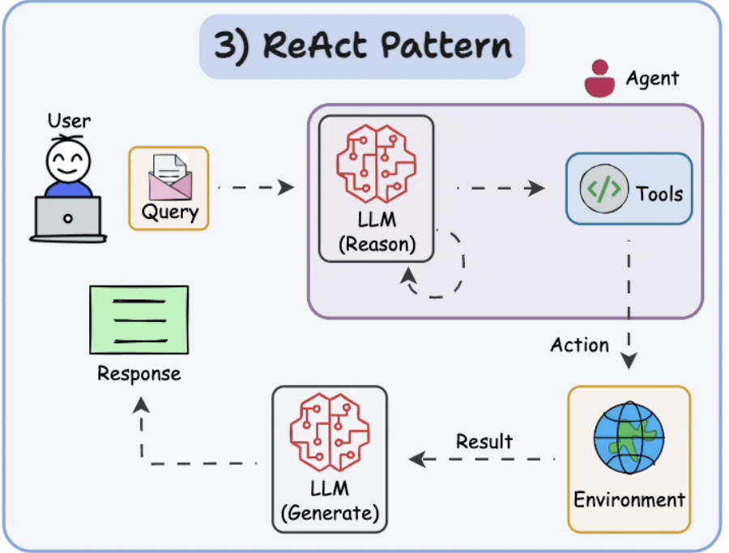
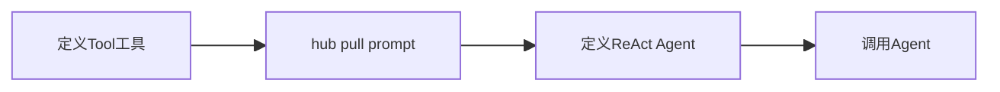
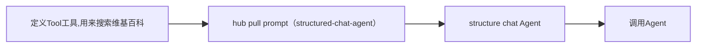
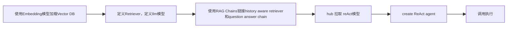
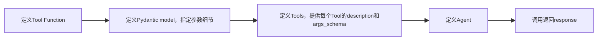
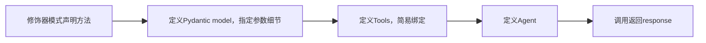
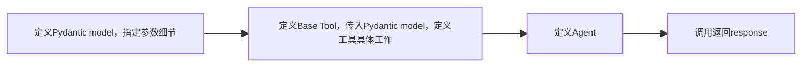

ReAct： Reasoning+Acting （推理+行动），AI 系统按照 ”思考-行动-观察-再思考“的循环解决问题

## Agent_and_tools_basics

```python
from dotenv import load_dotenv
from langchain import hub
from langchain.agents import (
    AgentExecutor,
    create_react_agent,
)
from langchain_core.tools import Tool
from langchain_openai import ChatOpenAI
from langchain_ollama import ChatOllama

# Load environment variables from .env file
load_dotenv()


# Define a very simple tool function that returns the current time
def get_current_time(*args, **kwargs):
    """Returns the current time in H:MM AM/PM format."""
    import datetime  # Import datetime module to get current time

    now = datetime.datetime.now()  # Get current time
    return now.strftime("%I:%M %p")  # Format time in H:MM AM/PM format


# List of tools available to the agent
tools = [
    Tool(
        name="Time",  # Name of the tool
        func=get_current_time,  # Function that the tool will execute
        # Description of the tool
        description="Useful for when you need to know the current time",
    ),
]

# Pull the prompt template from the hub
# ReAct = Reason and Action
# https://smith.langchain.com/hub/hwchase17/react
prompt = hub.pull("hwchase17/react")

# Initialize a ChatOpenAI model
llm = ChatOllama(
    model="llama3.1:8b", temperature=0
)

# Create the ReAct agent using the create_react_agent function
agent = create_react_agent(
    llm=llm,
    tools=tools,
    prompt=prompt,
)

# Create an agent executor from the agent and tools
agent_executor = AgentExecutor.from_agent_and_tools(
    agent=agent,
    tools=tools,
    verbose=True,
)

# Run the agent with a test query
response = agent_executor.invoke({"input": "What time is it?"})

# Print the response from the agent
print("response:", response)

```
OutPut:

```text
> Entering new AgentExecutor chain...
Thought: To find out what time it is, I should use a function that provides the current time.

Action: Time
Action Input: None (since we don't need any specific arguments)03:40 PMQuestion: What time is it?
Thought: Thought: To find out what time it is, I should use a function that provides the current time.

Action: Time
Action Input: None (since we don't need any specific arguments)03:40 PMIt seems like you're trying to determine the current time. Since the result of using the `Time` function is consistent, it's likely that the system is updating the time correctly.

Final Answer: The current time is 03:40 PM.

> Finished chain.
response: {'input': 'What time is it?', 'output': 'The current time is 03:40 PM.'}
```
## Agent_deep_dive
### Agent_ReAct_chat



```python
from dotenv import load_dotenv
from langchain import hub
from langchain.agents import AgentExecutor, create_structured_chat_agent
from langchain.memory import ConversationBufferMemory
from langchain_core.messages import AIMessage, HumanMessage, SystemMessage
from langchain_core.tools import Tool
from langchain_openai import ChatOpenAI
from langchain_ollama import ChatOllama

# Load environment variables from .env file
load_dotenv()


# Define Tools
def get_current_time(_: str = None):
    """Returns the current time in H:MM AM/PM format."""
    import datetime

    now = datetime.datetime.now()
    return now.strftime("%I:%M %p")


def search_wikipedia(query):
    """Searches Wikipedia and returns the summary of the first result."""
    from wikipedia import summary

    try:
        # Limit to two sentences for brevity
        return summary(query, sentences=2)
    except:
        return "I couldn't find any information on that."


# Define the tools that the agent can use
tools = [
    Tool(
        name="Time",
        func=get_current_time,
        description="Useful for when you need to know the current time.",
    ),
    Tool(
        name="Wikipedia",
        func=search_wikipedia,
        description="Useful for when you need to know information about a topic.",
    ),
]

# Load the correct JSON Chat Prompt from the hub
prompt = hub.pull("hwchase17/structured-chat-agent")

# Initialize a ChatOpenAI model
llm = ChatOllama(model="llama3.1:8b")

# Create a structured Chat Agent with Conversation Buffer Memory
# ConversationBufferMemory stores the conversation history, allowing the agent to maintain context across interactions
memory = ConversationBufferMemory(
    memory_key="chat_history", return_messages=True)

# create_structured_chat_agent initializes a chat agent designed to interact using a structured prompt and tools
# It combines the language model (llm), tools, and prompt to create an interactive agent
agent = create_structured_chat_agent(llm=llm, tools=tools, prompt=prompt)

# AgentExecutor is responsible for managing the interaction between the user input, the agent, and the tools
# It also handles memory to ensure context is maintained throughout the conversation
agent_executor = AgentExecutor.from_agent_and_tools(
    agent=agent,
    tools=tools,
    verbose=True,
    memory=memory,  # Use the conversation memory to maintain context
    handle_parsing_errors=True,  # Handle any parsing errors gracefully
)

# Initial system message to set the context for the chat
# SystemMessage is used to define a message from the system to the agent, setting initial instructions or context
initial_message = "You are an AI assistant that can provide helpful answers using available tools.\nIf you are unable to answer, you can use the following tools: Time and Wikipedia."
memory.chat_memory.add_message(SystemMessage(content=initial_message))

# Chat Loop to interact with the user
while True:
    user_input = input("User: ")
    if user_input.lower() == "exit":
        break

    # Add the user's message to the conversation memory
    memory.chat_memory.add_message(HumanMessage(content=user_input))

    # Invoke the agent with the user input and the current chat history
    response = agent_executor.invoke({"input": user_input})
    print("Bot:", response["output"])

    # Add the agent's response to the conversation memory
    memory.chat_memory.add_message(AIMessage(content=response["output"]))

```
Output:
```text
User: who is Steve Jobs


> Entering new AgentExecutor chain...
{
  "action": "Wikipedia",
  "action_input": "Steve Jobs"
}I couldn't find any information on that.{
  "action": "Wikipedia",
  "action_input": "Steve Jobs"
}I couldn't find any information on that.{
  "action": "Wikipedia",
  "action_input": "Steve Jobs biography"
}Steve Jobs is the authorized self-titled biography of American business magnate and Apple co-founder Steve Jobs. The book was written at the request of Jobs by Walter Isaacson, a former executive at CNN and Time who had previously written best-selling biographies of Benjamin Franklin and Albert Einstein.{
  "action": "Final Answer",
  "action_input": "Steve Jobs is an American business magnate and Apple co-founder, known for his innovative ideas and entrepreneurial spirit."
}

> Finished chain.
Bot: Steve Jobs is an American business magnate and Apple co-founder, known for his innovative ideas and entrepreneurial spirit.
```

### Agent_reAct_docstore

```python
import os

from dotenv import load_dotenv
from langchain import hub
from langchain.agents import AgentExecutor, create_react_agent
from langchain.chains import create_history_aware_retriever, create_retrieval_chain
from langchain.chains.combine_documents import create_stuff_documents_chain
from langchain_community.vectorstores import Chroma
from langchain_core.messages import AIMessage, HumanMessage
from langchain_core.prompts import ChatPromptTemplate, MessagesPlaceholder
from langchain_core.tools import Tool
from langchain_openai import ChatOpenAI, OpenAIEmbeddings
from langchain_ollama import ChatOllama, OllamaEmbeddings

# Load environment variables from .env file
load_dotenv()

# Load the existing Chroma vector store
current_dir = os.path.dirname(os.path.abspath(__file__))
db_dir = os.path.join(current_dir, "..", "..", "4_rag", "db")
persistent_directory = os.path.join(db_dir, "chroma_db_with_metadata")

# Check if the Chroma vector store already exists
if os.path.exists(persistent_directory):
    print("Loading existing vector store...")
    db = Chroma(persist_directory=persistent_directory,
                embedding_function=None)
else:
    raise FileNotFoundError(
        f"The directory {persistent_directory} does not exist. Please check the path."
    )

# Define the embedding model
embeddings = OllamaEmbeddings(model="nomic-embed-text")

# Load the existing vector store with the embedding function
db = Chroma(persist_directory=persistent_directory,
            embedding_function=embeddings)

# Create a retriever for querying the vector store
# `search_type` specifies the type of search (e.g., similarity)
# `search_kwargs` contains additional arguments for the search (e.g., number of results to return)
retriever = db.as_retriever(
    search_type="similarity",
    search_kwargs={"k": 3},
)

# Create a ChatOpenAI model
llm = ChatOllama(model="llama3.1:8b")

# Contextualize question prompt
# This system prompt helps the AI understand that it should reformulate the question
# based on the chat history to make it a standalone question
contextualize_q_system_prompt = (
    "Given a chat history and the latest user question "
    "which might reference context in the chat history, "
    "formulate a standalone question which can be understood "
    "without the chat history. Do NOT answer the question, just "
    "reformulate it if needed and otherwise return it as is."
)

# Create a prompt template for contextualizing questions
contextualize_q_prompt = ChatPromptTemplate.from_messages(
    [
        ("system", contextualize_q_system_prompt),
        MessagesPlaceholder("chat_history"),
        ("human", "{input}"),
    ]
)

# Create a history-aware retriever
# This uses the LLM to help reformulate the question based on chat history
history_aware_retriever = create_history_aware_retriever(
    llm, retriever, contextualize_q_prompt
)

# Answer question prompt
# This system prompt helps the AI understand that it should provide concise answers
# based on the retrieved context and indicates what to do if the answer is unknown
qa_system_prompt = (
    "You are an assistant for question-answering tasks. Use "
    "the following pieces of retrieved context to answer the "
    "question. If you don't know the answer, just say that you "
    "don't know. Use three sentences maximum and keep the answer "
    "concise."
    "\n\n"
    "{context}"
)

# Create a prompt template for answering questions
qa_prompt = ChatPromptTemplate.from_messages(
    [
        ("system", qa_system_prompt),
        MessagesPlaceholder("chat_history"),
        ("human", "{input}"),
    ]
)

# Create a chain to combine documents for question answering
# `create_stuff_documents_chain` feeds all retrieved context into the LLM
question_answer_chain = create_stuff_documents_chain(llm, qa_prompt)

# Create a retrieval chain that combines the history-aware retriever and the question answering chain
rag_chain = create_retrieval_chain(
    history_aware_retriever, question_answer_chain)


# Set Up ReAct Agent with Document Store Retriever
# Load the ReAct Docstore Prompt
react_docstore_prompt = hub.pull("hwchase17/react")

tools = [
    Tool(
        name="Answer Question",
        func=lambda input, **kwargs: rag_chain.invoke(
            {"input": input, "chat_history": kwargs.get("chat_history", [])}
        ),
        description="useful for when you need to answer questions about the context",
    )
]

# Create the ReAct Agent with document store retriever
agent = create_react_agent(
    llm=llm,
    tools=tools,
    prompt=react_docstore_prompt,
)

agent_executor = AgentExecutor.from_agent_and_tools(
    agent=agent, tools=tools, handle_parsing_errors=True, verbose=True,
)

chat_history = []
while True:
    query = input("You: ")
    if query.lower() == "exit":
        break
    response = agent_executor.invoke(
        {"input": query, "chat_history": chat_history})
    print(f"AI: {response['output']}")

    # Update history
    chat_history.append(HumanMessage(content=query))
    chat_history.append(AIMessage(content=response["output"]))

```

## Tools_deep_dive

### Tool_constructor


执行过程：意图识别+工具功能匹配+参数提取
Agent通过用户输入理解意图-> Agent通过工具的name和description匹配对应的工具 -> Agent提取Pydantic的参数->执行工具调用并返回结果

```python
# Docs: https://python.langchain.com/v0.1/docs/modules/tools/custom_tools/

# Import necessary libraries
from langchain import hub
from langchain.agents import AgentExecutor, create_tool_calling_agent
from langchain.pydantic_v1 import BaseModel, Field
from langchain_core.tools import StructuredTool, Tool
from langchain_openai import ChatOpenAI
from langchain_ollama import ChatOllama


# Functions for the tools
def greet_user(name: str) -> str:
    """Greets the user by name."""
    return f"Hello, {name}!"


def reverse_string(text: str) -> str:
    """Reverses the given string."""
    return text[::-1]


def concatenate_strings(a: str, b: str) -> str:
    """Concatenates two strings."""
    return a + b


# Pydantic model for tool arguments
class GreetUserArgs(BaseModel):
    name: str = Field(description="Name of the user to greet")

class ReverseStringArgs(BaseModel):
    text: str = Field(description="String to reverse")

class ConcatenateStringsArgs(BaseModel):
    a: str = Field(description="First string")
    b: str = Field(description="Second string")


# Create tools using the Tool and StructuredTool constructor approach
tools = [
    # Use Tool for simpler functions with a single input parameter.
    # This is straightforward and doesn't require an input schema.
    StructuredTool(
        name="GreetUser",  # Name of the tool
        func=greet_user,  # Function to execute
        description="Greets the user by name.",  # Description of the tool
        args_schema=GreetUserArgs
    ),
    # Use Tool for another simple function with a single input parameter.
    StructuredTool(
        name="ReverseString",  # Name of the tool
        func=reverse_string,  # Function to execute
        description="Reverses the given string.",  # Description of the tool
        args_schema=ReverseStringArgs  # Schema defining the tool's input argument
    ),
    # Use StructuredTool for more complex functions that require multiple input parameters.
    # StructuredTool allows us to define an input schema using Pydantic, ensuring proper validation and description.
    StructuredTool.from_function(
        func=concatenate_strings,  # Function to execute
        name="ConcatenateStrings",  # Name of the tool
        description="Concatenates two strings.",  # Description of the tool
        args_schema=ConcatenateStringsArgs,  # Schema defining the tool's input arguments
    ),
]

# Initialize a ChatOpenAI model
llm = ChatOllama(model="llama3.1:8b")

# Pull the prompt template from the hub
prompt = hub.pull("hwchase17/openai-tools-agent")

# Create the ReAct agent using the create_tool_calling_agent function
agent = create_tool_calling_agent(
    llm=llm,  # Language model to use
    tools=tools,  # List of tools available to the agent
    prompt=prompt,  # Prompt template to guide the agent's responses
)

# Create the agent executor
agent_executor = AgentExecutor.from_agent_and_tools(
    agent=agent,  # The agent to execute
    tools=tools,  # List of tools available to the agent
    verbose=True,  # Enable verbose logging
    handle_parsing_errors=True,  # Handle parsing errors gracefully
)

# Test the agent with sample queries
response = agent_executor.invoke({"input": "Greet Alice"})
print("Response for 'Greet Alice':", response)

response = agent_executor.invoke({"input": "Reverse the string 'hello'"})
print("Response for 'Reverse the string hello':", response)

response = agent_executor.invoke({"input": "Concatenate 'hello' and 'world'"})
print("Response for 'Concatenate hello and world':", response)

```

Output:
```text
> Entering new AgentExecutor chain...

Invoking: `GreetUser` with `{'name': 'Alice'}`


Hello, Alice!You can ask me any questions or seek help on any topic you'd like. I'll do my best to assist you. What's on your mind?

> Finished chain.
Response for 'Greet Alice': {'input': 'Greet Alice', 'output': "You can ask me any questions or seek help on any topic you'd like. I'll do my best to assist you. What's on your mind?"}


> Entering new AgentExecutor chain...

Invoking: `ReverseString` with `{'text': 'hello'}`


ollehThe reversed string is "olleh".

> Finished chain.
Response for 'Reverse the string hello': {'input': "Reverse the string 'hello'", 'output': 'The reversed string is "olleh".'}


> Entering new AgentExecutor chain...

Invoking: `ConcatenateStrings` with `{'a': 'hello', 'b': 'world'}`


helloworldThe output is 'helloworld'. This is the result of concatenating the two strings 'hello' and 'world'.

> Finished chain.
Response for 'Concatenate hello and world': {'input': "Concatenate 'hello' and 'world'", 'output': "The output is 'helloworld'. This is the result of concatenating the two strings 'hello' and 'world'."}
```

### Tool_decorator

其中 修饰器模式声明的方法内，通过doc string 声明函数作用，用于Agent的解析匹配
```python
# Documentation: https://python.langchain.com/v0.1/docs/modules/tools/custom_tools/

# Import necessary libraries
from langchain import hub
from langchain.agents import AgentExecutor, create_tool_calling_agent
from langchain.pydantic_v1 import BaseModel, Field
from langchain.tools import tool
from langchain_openai import ChatOpenAI
from langchain_ollama import ChatOllama


# Simple Tool with one parameter without args_schema
# This is a basic tool that does not require an input schema.
# Use this approach for simple functions that need only one parameter.
@tool()
def greet_user(name: str) -> str:
    """Greets the user by name."""
    return f"Hello, {name}!"


# Pydantic models for tool arguments
# Define a Pydantic model to specify the input schema for tools that need more structured input.
class ReverseStringArgs(BaseModel):
    text: str = Field(description="Text to be reversed")


# Tool with One Parameter using args_schema
# Use the args_schema parameter to specify the input schema using a Pydantic model.
@tool(args_schema=ReverseStringArgs)
def reverse_string(text: str) -> str:
    """Reverses the given string."""
    return text[::-1]


# Another Pydantic model for tool arguments
class ConcatenateStringsArgs(BaseModel):
    a: str = Field(description="First string")
    b: str = Field(description="Second string")


# Tool with Two Parameters using args_schema
# This tool requires multiple input parameters, so we use the args_schema to define the schema.
@tool(args_schema=ConcatenateStringsArgs)
def concatenate_strings(a: str, b: str) -> str:
    """Concatenates two strings."""
    print("a", a)
    print("b", b)
    return a + b


# Create tools using the @tool decorator
# The @tool decorator simplifies the process of defining tools by handling the setup automatically.
tools = [
    greet_user,  # Simple tool without args_schema
    reverse_string,  # Tool with one parameter using args_schema
    concatenate_strings,  # Tool with two parameters using args_schema
]

# Initialize a ChatOpenAI model
llm = ChatOllama(model="llama3.1:8b")

# Pull the prompt template from the hub
prompt = hub.pull("hwchase17/openai-tools-agent")

# Create the ReAct agent using the create_tool_calling_agent function
# This function sets up an agent capable of calling tools based on the provided prompt.
agent = create_tool_calling_agent(
    llm=llm,  # Language model to use
    tools=tools,  # List of tools available to the agent
    prompt=prompt,  # Prompt template to guide the agent's responses
)

# Create the agent executor
agent_executor = AgentExecutor.from_agent_and_tools(
    agent=agent,  # The agent to execute
    tools=tools,  # List of tools available to the agent
    verbose=True,  # Enable verbose logging
    handle_parsing_errors=True,  # Handle parsing errors gracefully
)

# Test the agent with sample queries
response = agent_executor.invoke({"input": "Greet Alice"})
print("Response for 'Greet Alice':", response)

response = agent_executor.invoke({"input": "Reverse the string 'hello'"})
print("Response for 'Reverse the string hello':", response)

response = agent_executor.invoke({"input": "Concatenate 'hello' and 'world'"})
print("Response for 'Concatenate hello and world':", response)

```
Output：
```text
> Entering new AgentExecutor chain...

Invoking: `greet_user` with `{'name': 'Alice'}`


Hello, Alice!Since you asked me to greet Alice and I was able to execute the command successfully. 

Would you like to know how to make a cup of coffee or need help with anything else?

> Finished chain.
Response for 'Greet Alice': {'input': 'Greet Alice', 'output': 'Since you asked me to greet Alice and I was able to execute the command successfully. \n\nWould you like to know how to make a cup of coffee or need help with anything else?'}


> Entering new AgentExecutor chain...

Invoking: `reverse_string` with `{'text': 'hello'}`


ollehThe reversed string is: olleh

> Finished chain.
Response for 'Reverse the string hello': {'input': "Reverse the string 'hello'", 'output': 'The reversed string is: olleh'}


> Entering new AgentExecutor chain...

Invoking: `concatenate_strings` with `{'a': 'hello', 'b': 'world'}`


a hello
b world
helloworldThe strings 'hello' and 'world' have been concatenated to form the string 'helloworld'.

> Finished chain.
Response for 'Concatenate hello and world': {'input': "Concatenate 'hello' and 'world'", 'output': "The strings 'hello' and 'world' have been concatenated to form the string 'helloworld'."}
```

### Tool_base_tool


```python
# Docs: https://python.langchain.com/v0.1/docs/modules/tools/custom_tools/

# Import necessary libraries
import os
from typing import Type

from dotenv import load_dotenv
from langchain import hub
from langchain.agents import AgentExecutor, create_tool_calling_agent
from langchain.pydantic_v1 import BaseModel, Field
from langchain_core.tools import BaseTool
from langchain_openai import ChatOpenAI


load_dotenv()

# Pydantic models for tool arguments


class SimpleSearchInput(BaseModel):
    query: str = Field(description="should be a search query")


class MultiplyNumbersArgs(BaseModel):
    x: float = Field(description="First number to multiply")
    y: float = Field(description="Second number to multiply")


# Custom tool with only custom input


class SimpleSearchTool(BaseTool):
    name = "simple_search"
    description = "useful for when you need to answer questions about current events"
    args_schema: Type[BaseModel] = SimpleSearchInput

    def _run(
        self,
        query: str,
    ) -> str:
        """Use the tool."""
        from tavily import TavilyClient

        api_key = os.getenv("TAVILY_API_KEY")
        client = TavilyClient(api_key=api_key)
        results = client.search(query=query)
        return f"Search results for: {query}\n\n\n{results}\n"


# Custom tool with custom input and output
class MultiplyNumbersTool(BaseTool):
    name = "multiply_numbers"
    description = "useful for multiplying two numbers"
    args_schema: Type[BaseModel] = MultiplyNumbersArgs

    def _run(
        self,
        x: float,
        y: float,
    ) -> str:
        """Use the tool."""
        result = x * y
        return f"The product of {x} and {y} is {result}"


# Create tools using the Pydantic subclass approach
tools = [
    SimpleSearchTool(),
    MultiplyNumbersTool(),
]

# Initialize a ChatOpenAI model
llm = ChatOpenAI(model="gpt-4o")

# Pull the prompt template from the hub
prompt = hub.pull("hwchase17/openai-tools-agent")

# Create the ReAct agent using the create_tool_calling_agent function
agent = create_tool_calling_agent(
    llm=llm,
    tools=tools,
    prompt=prompt,
)

# Create the agent executor
agent_executor = AgentExecutor.from_agent_and_tools(
    agent=agent,
    tools=tools,
    verbose=True,
    handle_parsing_errors=True,
)

# Test the agent with sample queries
response = agent_executor.invoke({"input": "Search for Apple Intelligence"})
print("Response for 'Search for LangChain updates':", response)

response = agent_executor.invoke({"input": "Multiply 10 and 20"})
print("Response for 'Multiply 10 and 20':", response)

```

