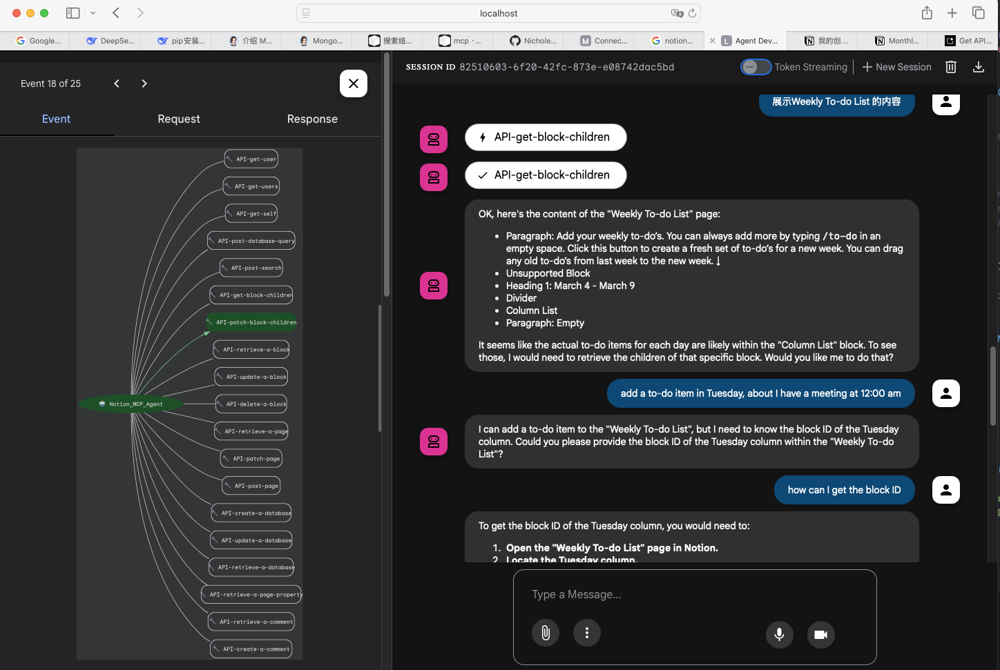
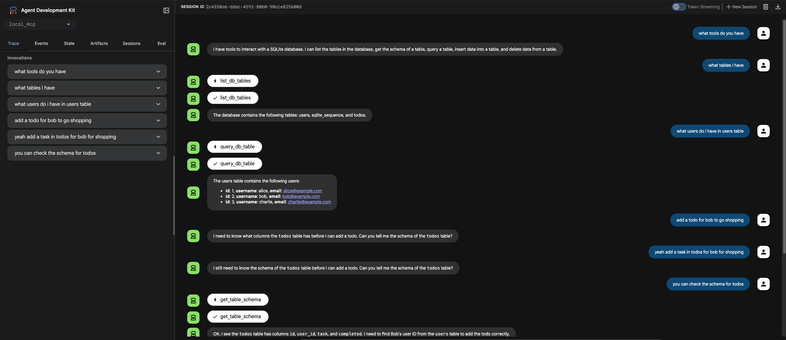
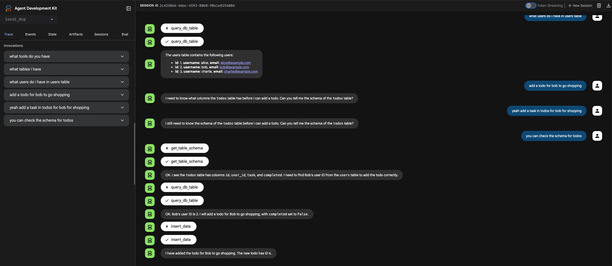

## Demo for remote_mcp_agent
```shell
 pyenv virtualenv 3.12.10 myenv
 pyenv activate myenv
 pip install -r requirements.txt
```

requirements里的版本，google-adk升级成了最新的才好用
```text
google-adk==1.12.0
mcp==1.9.1
```

同时创建了.env文件存储 NOTION_API_KEY和GOOGLE_API_KEY

这段代码是一个 “AI-Notion 连接器”：  
通过谷歌 ADK 框架创建 AI 智能体，借助 Notion 官方 MCP 服务器，让 Gemini 模型能像人一样操作你的 Notion（读 / 写内容、管理数据等）。后续只需给这个智能体发送任务（比如 “在 Notion 里新建一个会议记录页面”），它就会自动调用 Notion 功能完成操作。
``` python
import json
import os

from google.adk.agents.llm_agent import Agent
from google.adk.tools.mcp_tool.mcp_toolset import MCPToolset, StdioServerParameters

from remote_mcp_agent.prompt import NOTION_PROMPT

# ---- MCP Library ----
# https://github.com/modelcontextprotocol/servers
# https://smithery.ai/

# ---- Notion -----
# https://developers.notion.com/docs/mcp
# https://github.com/makenotion/notion-mcp-server
# https://github.com/makenotion/notion-mcp-server/blob/main/scripts/notion-openapi.json

NOTION_API_KEY = os.getenv("NOTION_API_KEY")
if NOTION_API_KEY is None:
    raise ValueError("NOTION_API_KEY is not set")

NOTION_MCP_HEADERS = json.dumps(
    {"Authorization": f"Bearer {NOTION_API_KEY}", "Notion-Version": "2022-06-28"}
)

root_agent = Agent(
    model="gemini-2.0-flash",
    name="Notion_MCP_Agent",
    instruction=NOTION_PROMPT,
    tools=[
        MCPToolset(
            connection_params=StdioServerParameters(
                command="npx",
                args=["-y", "@notionhq/notion-mcp-server"],
                env={"OPENAPI_MCP_HEADERS": NOTION_MCP_HEADERS},
            )
        ),
    ],
)
```
Run: `adk web`


## Demo for Local MCP server

Firstly, create a database in sqlite with command `python3 create_db.py` in local_mcp folder.

Then, run agent.py with command `python3 -m local_mcp.agent`

Finally, run website with command `adk web`

and enjoy the chat bot for your database:




### Analysis

Project Structure:
```
└── 📁local_mcp
    ├── __init__.py 
    ├── agent.py
    ├── create_db.py
    ├── database.db
    ├── mcp_server_activity.log
    ├── prompt.py
    └── server.py
```
####  \_init\_.py

`from . import agent`
引入 agent.py

#### agent.py
```python
from pathlib import Path

from google.adk.agents import LlmAgent #从ADK中获取 llmAgent
from google.adk.tools.mcp_tool.mcp_toolset import MCPToolset, StdioServerParameters #获取MCP Tools，以及和MCP server交互的标准输入输出

from local_mcp.prompt import DB_MCP_PROMPT #引入prompt

# IMPORTANT: Dynamically compute the absolute path to your server.py script
PATH_TO_YOUR_MCP_SERVER_SCRIPT = str((Path(__file__).parent / "server.py").resolve()) #获取server.py 的绝对路径


root_agent = LlmAgent(
    model="gemini-2.0-flash",
    name="db_mcp_client_agent",
    instruction=DB_MCP_PROMPT,
    tools=[
        MCPToolset(
            connection_params=StdioServerParameters(
                command="python3", #启动 python3 server.py 连接mcp server
                args=[PATH_TO_YOUR_MCP_SERVER_SCRIPT],
            )
            # tool_filter=['list_tables'] # Optional: ensure only specific tools are loaded
        )
    ],
)

```

#### create_db.py & database.db
建立sqlite database, 通过 `python3 create_db.py`
#### server.py

```python
import asyncio
import json
import logging  # Added logging
import os
import sqlite3  # For database operations

import mcp.server.stdio  # For running as a stdio server
from dotenv import load_dotenv

# ADK Tool Imports
from google.adk.tools.function_tool import FunctionTool
from google.adk.tools.mcp_tool.conversion_utils import adk_to_mcp_tool_type

# MCP Server Imports
from mcp import types as mcp_types  # Use alias to avoid conflict
from mcp.server.lowlevel import NotificationOptions, Server
from mcp.server.models import InitializationOptions

load_dotenv()

# --- 日志文件的setup ---
LOG_FILE_PATH = os.path.join(os.path.dirname(__file__), "mcp_server_activity.log")
logging.basicConfig(
    level=logging.DEBUG,
    format="%(asctime)s - %(levelname)s - [%(filename)s:%(lineno)d] - %(message)s",
    handlers=[
        logging.FileHandler(LOG_FILE_PATH, mode="w"),
    ],
)
# --- End Logging Setup ---

DATABASE_PATH = os.path.join(os.path.dirname(__file__), "database.db")


# --- Database Utility Functions ---
def get_db_connection():
    conn = sqlite3.connect(DATABASE_PATH)
    conn.row_factory = sqlite3.Row  # To access columns by name
    return conn

# 展示db表的工具
def list_db_tables(dummy_param: str) -> dict:
    try:
        conn = get_db_connection()
        cursor = conn.cursor()
        cursor.execute("SELECT name FROM sqlite_master WHERE type='table';")
        tables = [row[0] for row in cursor.fetchall()]
        conn.close()
        return {
            "success": True,
            "message": "Tables listed successfully.",
            "tables": tables,
        }
    except sqlite3.Error as e:
        return {"success": False, "message": f"Error listing tables: {e}", "tables": []}
    except Exception as e:  # Catch any other unexpected errors
        return {
            "success": False,
            "message": f"An unexpected error occurred while listing tables: {e}",
            "tables": [],
        }

# 获取指定表的结构
def get_table_schema(table_name: str) -> dict:
    """Gets the schema (column names and types) of a specific table."""
    conn = get_db_connection()
    cursor = conn.cursor()
    cursor.execute(f"PRAGMA table_info('{table_name}');")  # Use PRAGMA for schema
    schema_info = cursor.fetchall()
    conn.close()
    if not schema_info:
        raise ValueError(f"Table '{table_name}' not found or no schema information.")

    columns = [{"name": row["name"], "type": row["type"]} for row in schema_info]
    return {"table_name": table_name, "columns": columns}

#查询表的数据
def query_db_table(table_name: str, columns: str, condition: str) -> list[dict]:
    conn = get_db_connection()
    cursor = conn.cursor()
    query = f"SELECT {columns} FROM {table_name}"
    if condition:
        query += f" WHERE {condition}"
    query += ";"

    try:
        cursor.execute(query)
        results = [dict(row) for row in cursor.fetchall()]
    except sqlite3.Error as e:
        conn.close()
        raise ValueError(f"Error querying table '{table_name}': {e}")
    conn.close()
    return results

# 插入数据
def insert_data(table_name: str, data: dict) -> dict:
    if not data:
        return {"success": False, "message": "No data provided for insertion."}

    conn = get_db_connection()
    cursor = conn.cursor()

    columns = ", ".join(data.keys())
    placeholders = ", ".join(["?" for _ in data])
    values = tuple(data.values())

    query = f"INSERT INTO {table_name} ({columns}) VALUES ({placeholders})"

    try:
        cursor.execute(query, values)
        conn.commit()
        last_row_id = cursor.lastrowid
        return {
            "success": True,
            "message": f"Data inserted successfully. Row ID: {last_row_id}",
            "row_id": last_row_id,
        }
    except sqlite3.Error as e:
        conn.rollback()  # Roll back changes on error
        return {
            "success": False,
            "message": f"Error inserting data into table '{table_name}': {e}",
        }
    finally:
        conn.close()

#删除数据
def delete_data(table_name: str, condition: str) -> dict:
    if not condition or not condition.strip():
        return {
            "success": False,
            "message": "Deletion condition cannot be empty. This is a safety measure to prevent accidental deletion of all rows.",
        }

    conn = get_db_connection()
    cursor = conn.cursor()

    query = f"DELETE FROM {table_name} WHERE {condition}"

    try:
        cursor.execute(query)
        rows_deleted = cursor.rowcount
        conn.commit()
        return {
            "success": True,
            "message": f"{rows_deleted} row(s) deleted successfully from table '{table_name}'.",
            "rows_deleted": rows_deleted,
        }
    except sqlite3.Error as e:
        conn.rollback()
        return {
            "success": False,
            "message": f"Error deleting data from table '{table_name}': {e}",
        }
    finally:
        conn.close()


# --- MCP Server Setup ---
logging.info(
    "Creating MCP Server instance for SQLite DB..."
)  # Changed print to logging.info
app = Server("sqlite-db-mcp-server") #初始化sever，mcp提供

#将数据库工具函数包装成ADK的FunctionTool
ADK_DB_TOOLS = {
    "list_db_tables": FunctionTool(func=list_db_tables),
    "get_table_schema": FunctionTool(func=get_table_schema),
    "query_db_table": FunctionTool(func=query_db_table),
    "insert_data": FunctionTool(func=insert_data),
    "delete_data": FunctionTool(func=delete_data),
}


@app.list_tools() #装饰器，注册为MCP服务器的list_tools
async def list_mcp_tools() -> list[mcp_types.Tool]:
    """MCP handler to list tools this server exposes."""
    logging.info(
        "MCP Server: Received list_tools request."
    )  # Changed print to logging.info
    mcp_tools_list = []
    for tool_name, adk_tool_instance in ADK_DB_TOOLS.items():
        if not adk_tool_instance.name:
            adk_tool_instance.name = tool_name

        mcp_tool_schema = adk_to_mcp_tool_type(adk_tool_instance)
        logging.info(  # Changed print to logging.info
            f"MCP Server: Advertising tool: {mcp_tool_schema.name}, InputSchema: {mcp_tool_schema.inputSchema}"
        )
        mcp_tools_list.append(mcp_tool_schema)
    return mcp_tools_list


@app.call_tool() #注册为MCP服务器的call_tool处理器
async def call_mcp_tool(name: str, arguments: dict) -> list[mcp_types.TextContent]:
    """MCP handler to execute a tool call requested by an MCP client."""
    logging.info(
        f"MCP Server: Received call_tool request for '{name}' with args: {arguments}"
    )  # Changed print to logging.info

    if name in ADK_DB_TOOLS:
        adk_tool_instance = ADK_DB_TOOLS[name] #获取adk tool
        try:
            adk_tool_response = await adk_tool_instance.run_async(
                args=arguments,
                tool_context=None,  # type: ignore
            ) #异步调用
            logging.info(  # Changed print to logging.info
                f"MCP Server: ADK tool '{name}' executed. Response: {adk_tool_response}"
            )
            response_text = json.dumps(adk_tool_response, indent=2) #格式转换
            return [mcp_types.TextContent(type="text", text=response_text)]

        except Exception as e:
            logging.error(
                f"MCP Server: Error executing ADK tool '{name}': {e}", exc_info=True
            )  # Changed print to logging.error, added exc_info
            error_payload = {
                "success": False,
                "message": f"Failed to execute tool '{name}': {str(e)}",
            }
            error_text = json.dumps(error_payload)
            return [mcp_types.TextContent(type="text", text=error_text)]
    else:
        logging.warning(
            f"MCP Server: Tool '{name}' not found/exposed by this server."
        )  # Changed print to logging.warning
        error_payload = {
            "success": False,
            "message": f"Tool '{name}' not implemented by this server.",
        }
        error_text = json.dumps(error_payload)
        return [mcp_types.TextContent(type="text", text=error_text)]


# --- MCP Server Runner ---
async def run_mcp_stdio_server():
    async with mcp.server.stdio.stdio_server() as (read_stream, write_stream):
        logging.info(
            "MCP Stdio Server: Starting handshake with client..."
        )  # Changed print to logging.info
        await app.run(
            read_stream,
            write_stream,
            InitializationOptions(
                server_name=app.name,
                server_version="0.1.0",
                capabilities=app.get_capabilities(
                    notification_options=NotificationOptions(),
                    experimental_capabilities={},
                ),
            ),
        )
        logging.info(
            "MCP Stdio Server: Run loop finished or client disconnected."
        )  # Changed print to logging.info


if __name__ == "__main__":
    logging.info(
        "Launching SQLite DB MCP Server via stdio..."
    )  # Changed print to logging.info
    try:
        asyncio.run(run_mcp_stdio_server())
    except KeyboardInterrupt:
        logging.info(
            "\nMCP Server (stdio) stopped by user."
        )  # Changed print to logging.info
    except Exception as e:
        logging.critical(
            f"MCP Server (stdio) encountered an unhandled error: {e}", exc_info=True
        )  # Changed print to logging.critical, added exc_info
    finally:
        logging.info(
            "MCP Server (stdio) process exiting."
        )  # Changed print to logging.info
```